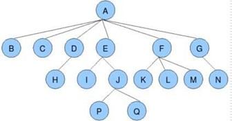
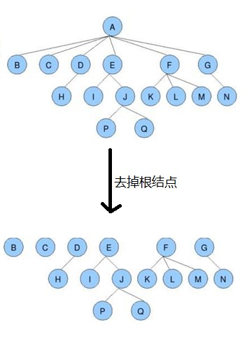
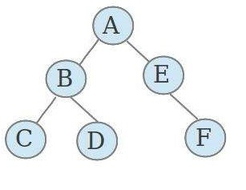
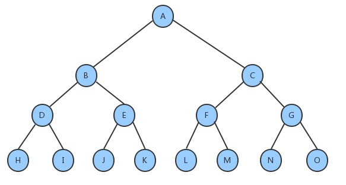
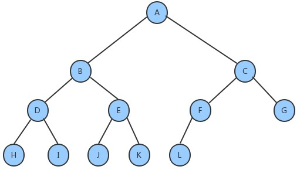
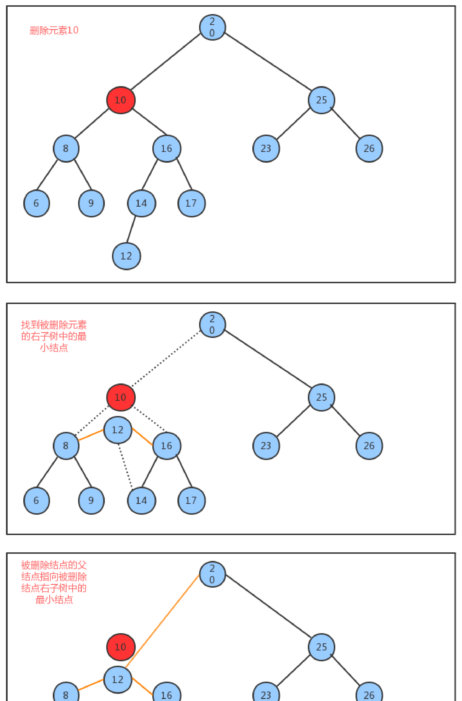
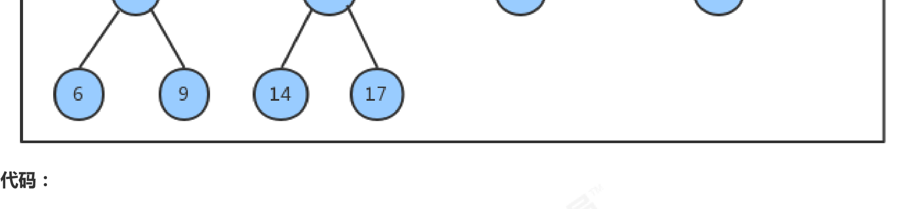
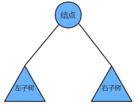
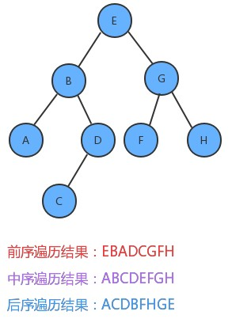

之前我们实现的符号表中，不难看出，符号表的增删查操作，随着元素个数 N 的增多，其耗时也是线性增多的，时间复杂度都是 O(n)，为了提高运算效率，接下来我们学习树这种数据结构。

# 一、树的基本定义

树是我们计算机中非常重要的一种数据结构，同时使用树这种数据结构，可以描述现实生活中的很多事物，例如家谱、单位的组织架构、等等。

树是由 n（n\>=1）个有限结点组成一个具有层次关系的集合。把它叫做“树”是因为它看起来像一棵倒挂的树，也就是说它是根朝上，而叶朝下的。



树具有以下特点：

* 每个结点有零个或多个子结点
* 没有父结点的结点为根结点
* 每一个非根结点只有一个父结点
* 每个结点及其后代结点整体上可以看做是一棵树，称为当前结点的父结点的一个子树；

# 二、树的相关术语

**结点的度**：

> 一个结点含有的子树的个数称为该结点的度；

**叶结点**：

> 度为 0 的结点称为叶结点，也可以叫做终端结点

**分支结点**：

> 度不为 0 的结点称为分支结点，也可以叫做非终端结点

**结点的层次**：

> 从根结点开始，根结点的层次为 1，根的直接后继层次为 2，以此类推

**结点的层序编号**：

> 将树中的结点，按照从上层到下层，同层从左到右的次序排成一个线性序列，把他们编成连续的自然数。

**树的度**：

> 树中所有结点的度的最大值

**树的高度（深度）**：

> 树中结点的最大层次

**森林**：

> m（m >= 0）个互不相交的树的集合，将一颗非空树的根结点删去，树就变成一个森林；给森林增加一个统一的根结点，森林就变成一棵树



**孩子结点**：

> 一个结点的直接后继结点称为该结点的孩子结点

**双亲结点（父结点）**

> 一个结点的直接前驱称为该结点的双亲结点

**兄弟结点**：

> 同一双亲结点的孩子结点间互称兄弟结点

# 三、二叉树的基本定义

二叉树就是度不超过 2 的树（每个结点最多有两个子结点）



**满二叉树**：

一个二叉树，如果每一个层的结点树都达到最大值，则这个二叉树就是满二叉树。



**完全二叉树**：

叶节点只能出现在最下层和次下层，并且最下面一层的结点都集中在该层最左边的若干位置的二叉树



# 四、二叉查找树的创建

## 1、二叉树的结点类

根据对图的观察，我们发现二叉树其实就是由一个一个的结点及其之间的关系组成的，按照面向对象的思想，我们设计一个结点类来描述结点这个事物。

**结点类API设计**：

| 类名     | Node\<Key,Value>                                             |
| -------- | ------------------------------------------------------------ |
| 构造方法 | Node(Key key, Value value, Node left, Node right)：创建 Node 对象 |
| 成员变量 | 1.public Node left：记录左子结点<br/>1.public Node right：记录右子结点<br/>1.public Key key：存储键<br/>1.public Value value：存储值 |

**代码实现**：

```java
private class Node<Key,Value>{
    //存储键
    public Key key;
    //存储值
    private Value value;
    //记录左子结点
    public Node left;
    //记录右子结点
    public Node right;
    
    public Node(Key key, Value value, Node left, Node right) {
        this.key = key;
        this.value = value;
        this.left = left;
        this.right = right;
    }
}
```

## 2、二叉查找树 API 设计

| 类名     | BinaryTree<Key extends Comparable\<Key>,Value value>         |
| -------- | ------------------------------------------------------------ |
| 构造方法 | BinaryTree()：创建 BinaryTree 对象                           |
| 成员变量 | 1.private Node root：记录根结点<br/>2.private int N：记录树中元素的个数 |
| 成员方法 | 1.public void put(Key key,Value value)：向树中插入一个键值对<br/>2.private Node put(Node x, Key key, Value value)：给指定树 x 上添加一个键值对，并返回添加后的新树<br/>3.public Value get(Key key)：根据 key，从树中找出对应的值<br/>4.private Value get(Node x, Key key)：从指定的树 x 中找出 key 对应的值<br/>5.public void delete(Key key)：根据 key 删除树中对应的键值对<br/>6.private Node delete(Node x, Key key)：删除指定树 x 上键为 key 的键值对，并返回删除后的新树7.public int size()：获取树中元素的个数 |

## 3、二叉查找树实现

**插入方法 put 实现思想**：

1. 如果当前树中没有任何一个结点，则直接把新结点当做根结点使用
2. 如果当前树不为空，则从根结点开始：
   1. 如果新结点的 key 小于当前结点的 key，则继续找当前结点的左子结点
   2. 如果新结点的 key 大于当前结点的 key，则继续找当前结点的右子结点
   3. 如果新结点的 key 等于当前结点的 key，则树中已经存在这样的结点，替换该结点的 value 值即可


**查询方法 get 实现思想**：

从根节点开始：

1. 如果要查询的 key 小于当前结点的 key，则继续找当前结点的左子结点
2. 如果要查询的 key 大于当前结点的 key，则继续找当前结点的右子结点
3. 如果要查询的 key 等于当前结点的 key，则树中返回当前结点的 value

**删除方法 delete 实现思想**：

1. 找到被删除结点
2. 找到被删除结点右子树中的最小结点 minNode
3. 删除右子树中的最小结点
4. 让被删除结点的左子树成为最小结点 minNode 的左子树，让被删除结点的右子树成为最小结点 minNode 的右子树
5. 让被删除结点的父节点指向最小结点 minNode





```java
public class BinaryTree<Key extends Comparable<Key>,Value> {
    //记录根节点
    private Node root;
    //记录树中元素的个数
    private int N;

    private class Node{
        //存储键
        public Key key;
        //存储值
        private Value value;
        //记录左子结点
        public Node left;
        //记录右子结点
        public Node right;

        public Node(Key key, Value value, Node left, Node right) {
            this.key = key;
            this.value = value;
            this.left = left;
            this.right = right;
        }
    }

    //获取树中元素的个数
    public int size(){
        return N;
    }

    //向树中添加元素key-value
    public void put(Key key,Value value){
        root = put(root,key,value);
    }

    //向指定的树x中添加key-value，并返回添元素后的新树
    private Node put(Node x,Key key,Value value){
        //如果x子树为空
        if (x==null){
            N++;
            return new Node(key,value,null,null);
        }

        //如果x子树不为空，则比较x结点的键和key的大小
        int cmp = key.compareTo(x.key);
        if (cmp>0){
            //如果key大于x结点的键，则继续找x结点的右子树
            x.right = put(x.right,key,value);
        }else if (cmp<0){
            //如果key小于x结点的键，则继续找x结点的左子树
            x.left = put(x.left,key,value);
        }else {
            //如果key等于x结点的键，则替换x结点的值为value即可
            x.value = value;
        }

        return x;
    }

    //查询树中指定key对应的value
    public Value get(Key key){
        return get(root,key);
    }

    //从指定的树x中，查找key对应的值
    public Value get(Node x,Key key){
        //如果x树为空
        if (x==null){
            return null;
        }

        //如果x树不为空，则毕节key和x结点的键的大小
        int cmp = key.compareTo(x.key);
        if (cmp>0){
            //如果key大于x结点的键，则继续找x结点的右子树
            return get(x.right,key);
        }else if (cmp<0){
            //如果key小于x结点的键，则继续找x结点的左子树
            return get(x.left,key);
        }else {
            //如果key等于x结点的键，则返回x结点的值即可
            return x.value;
        }
    }

    //删除树中key对应的value
    public void delete(Key key){
        delete(root,key);
    }

    //删除指定树x中的key对应的value，并返回删除后的新树
    public Node delete(Node x,Key key){
        //如果x树为null
        if (x==null){
            return null;
        }

        //如果x树不为null
        int cmp = key.compareTo(x.key);
        if (cmp>0){
            //如果key大于x结点的键，则继续找x结点的右子树
            x.right = delete(x.right,key);
        }else if (cmp<0){
            //如果key小于x结点的键，则继续找x结点的左子树
            x.left = delete(x.left,key);
        }else {
            //如果key等于x结点的键，则要删除的结点就是x，完成真正的删除结点动作
            N--;

            //如果x右子树为null
            if (x.right==null){
                return x.left;
            }
            //如果x左子树为null
            if (x.left==null){
                return x.right;
            }

            //如果左右子树都不为空，先找到右子树中最小的结点
            Node minNode = x.right;
            while (minNode.left!=null){
                minNode = minNode.left;
            }

            //删除右子树中最小的结点
            Node n = x.right;
            while (n.left!=null){
                if (n.left.left==null){
                    n.left = null;
                }else {
                    n = n.left;
                }
            }

            //让x结点的左右子树分别成为minNode的左右子树
            minNode.left = x.left;
            minNode.right = x.right;
            //让x结点的父结点指向minNode
            x = minNode;
        }

        return x;
    }
}
```

测试代码：

```java
public class BinaryTreeTest {
    public static void main(String[] args) {
        BinaryTree<Integer, String> tree = new BinaryTree<>();

        //测试插入
        tree.put(1,"张三");
        tree.put(2,"李四");
        tree.put(3,"王五");
        System.out.println("插入完毕后元素的个数："+tree.size());

        //测试获取
        System.out.println("键2对应的元素是："+tree.get(2));

        //测试删除
        tree.delete(3);
        System.out.println("删除后的元素个数："+tree.size());
        System.out.println("删除后键3对应的元素是："+tree.get(3));
    }
}
```

## 4、二叉查找树其他便捷方法

### 4.1、查找二叉树中最小的键

在某些情况下，我们需要查找出树中存储所有元素的键的最小值，比如我们的树中存储的是学生的排名和姓名数据，那么需要查找出排名最低是多少名？这里我们设计如下两个方法来完成：

* public Key min()：找出树中最小的键
* private Node min(Node x)：找出指定树 x 中，最小键所在的结点

```java
//查找整个树中最小的键
public Key min(){
    return min(root).key;
}

//在指定树x中找出最小键所在的结点
public Node min(Node x){
    //如果x还有左子结点，则继续找
    if (x.left!=null){
        return min(x.left);
    }else {//若没有，则x就是最小键所在的结点
        return x;
    }
}
```

### 4.2、查找二叉树中最大的键

在某些情况下，我们需要查找出树中存储所有元素的键的最大值，比如比如我们的树中存储的是学生的成绩和学生的姓名，那么需要查找出最高的分数是多少？这里我们同样设计两个方法来完成：

* public Key max()：找出树中最大的键
* public Node max(Node x)：找出指定树 x 中，最大键所在的结点

```java
//查找整个树中最大的键
    public Key max(){
        return max(root).key;
    }

    //在指定树x中找出最大键所在的结点
    public Node max(Node x){
        //如果x还有右子结点，则继续找
        if (x.left!=null){
            return max(x.left);
        }else {//若没有，则x就是最大键所在的结点
            return x;
        }
    }
```

# 五、二叉树的基础遍历

## 1、概述

很多情况下，我们可能需要像遍历数组数组一样，遍历树，从而拿出树中存储的每一个元素，由于树状结构和线性结构不一样，它没有办法从头开始依次向后遍历，所以存在如何遍历，也就是按照什么样的**搜索路径**进行遍历的问题。



我们把树简单的画作上图中的样子，由一个根节点、一个左子树、一个右子树组成，那么按照根节点什么时候被访问，我们可以把二叉树的遍历分为以下三种方式：

1. 前序遍历：先访问根结点，然后再访问左子树，最后访问右子树

2. 中序遍历：先访问左子树，中间访问根节点，最后访问右子树

3. 后序遍历：先访问左子树，再访问右子树，最后访问根节点

如果我们分别对下面的树使用三种遍历方式进行遍历，得到的结果如下：


