# 一、线性表概述

线性表是最基本、最简单也是最常用的一种数据结构。一个线性表是 n 个具有相同特性的数据元素的有限序列。


前驱元素：若 A 元素在 B 元素的前面，则称 A 为 B 的前驱元素

后继元素：若 B 元素在 A 元素的后面，则称 B 为 A 的后继元素

> **线性表的特征**：数据元素之间具有一种 "一对一" 的逻辑关系。

1.  第一个数据元素没有前驱，这个数据元素被称为头结点；

2.  最后一个数据元素没有后继，这个数据元素被称为尾结点；

3.  除了第一个和最后一个数据元素外，其他数据元素有且仅有一个前驱和一个后继。

如果把线性表用数学语言来定义，则可以表示为 (a1,\...ai-1,ai,ai+1,\...an)，ai-1 领先于 ai，ai 领先于 ai+1，称 ai-1 是ai 的前驱元素，ai+1 是 ai 的后继元素

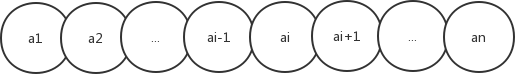

> **线性表的分类**：
>
> 线性表中数据存储的方式可以是顺序存储，也可以是链式存储，按照数据的存储方式不同，可以把线性表分为顺序表和链表。

# 二、顺序表

顺序表是在计算机内存中以数组的形式保存的线性表，线性表的顺序存储是指用一组地址连续的存储单元，依次存储线性表中的各个元素、使得线性表中再逻辑结构上响铃的数据元素存储在相邻的物理存储单元中，即通过数据元素物理存储的相邻关系来反映数据元素之间逻辑上的相邻关系。

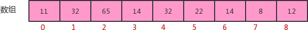

## 1、顺序表的实现

**顺序表 API 设计**：

| 类名     | SequenceList\<T>                                             |
| -------- | ------------------------------------------------------------ |
| 构造方法 | SequenceList(int capacity)：创建容量为capacity的SequenceList对象 |
| 成员方法 | 1.  public void clear()：空置线性表<br>2.  publicboolean isEmpty()：判断线性表是否为空，是返回 true，否返回 false<br>3.  public int length()：获取线性表中元素的个数<br>4.  public T get(int i)：读取并返回线性表中的第i个元素的值<br>5.  public void insert(int i,T t)：在线性表的第 i 个元素之前插入一个值为 t 的数据元素<br>6.  public void insert(T t)：向线性表中添加一个元素 t <br>7.  public T remove(int i)：删除并返回线性表中第 i 个数据元素<br>8.  public int indexOf(T t)：返回线性表中首次出现的指定元素的位序号，若不存在则返回 -1 |
| 成员变量 | 1.private T\[\] eles：存储元素的数组<br>2.private int N：当前线性表的长度 |

**顺序表的代码实现**：

```java
import java.util.Arrays;

public class SequenceList<T> {
    //存储元素的数组
    private T[] eles;
    //记录当前顺序表中元素的个数
    private int N;

    //构造方法
    public SequenceList(int capactity){
        //初始化数组
        this.eles=(T[]) new Object[capactity];
        //初始化长度
        this.N=0;
    }

    //将一个线性表置为空表
    public void clear(){
        this.N=0;
    }

    //判断当前线性表是否为空表
    public boolean isEmpty(){
        return N==0;
    }

    //获取线性表的长度
    public int length(){
        return N;
    }

    //获取指定位置的元素
    public T get(int i){
        if (i<0 || i>=N){
            throw new RuntimeException("当前元素不存在！");
        }
        return eles[i];
    }

    //向线性表中添加元素t
    public void insert(T t){
        if (N==eles.length)
            throw new RuntimeException("当前表已满");
        eles[N++]=t;
    }

    //在i元素处插入元素t
    public void insert(int i,T t){
        if (i==eles.length){
            throw new RuntimeException("当前表已满");
        }
        if (i<0 || i>N){
            throw new RuntimeException("插入的位置不合法");
        }

        //先把i索引处的元素及其后面的元素一次向后移一位
        for (int index=N;index>i;index--){
            eles[index]=eles[index-1];
        }
        //再把t元素放到i索引处即可
        eles[i]=t;
        N++;
    }

    //删除指定位置i处的元素，并返回该元素
    public T remove(int i){
        if (i<0 || i>N-1){
            throw new RuntimeException("当前要删除的元素不存在");
        }

        //记录索引i处的值
        T result=eles[i];
        //索引i后面的元素依次向前移动一位即可
        for (int index=i;index<N-1;index++){
            eles[index]=eles[index+1];
        }
        N--;
        return result;
    }

    //查找t元素第一次出现的位置
    public int indexOf(T t){
        if(t==null){
            throw new RuntimeException("查找的元素不合法");
        }

        for (int i=0;i<N;i++){
            if (eles[i].equals(t))
                return i;
        }
        return -1;
    }

    @Override
    public String toString() {
        return "SequenceList{" +
                "eles=" + Arrays.toString(eles) +
                ", N=" + N +
                '}';
    }
}
```

测试代码：

```java
public class SequenceListTest {
    public static void main(String[] args) {
        //创建顺序表对象
        SequenceList<String> sl = new SequenceList<>(10);

        //测试插入
        sl.insert("姚明");
        sl.insert("科比");
        sl.insert("麦迪");
        sl.insert(1,"艾弗森");
        System.out.println(sl);

        //测试获取
        String getResult=sl.get(1);
        System.out.println("获取索引1处的结果为："+getResult);

        //测试删除
        String removeResult = sl.remove(0);
        System.out.println("删除的元素是："+removeResult);

        //测试清空
        sl.clear();
        System.out.println("清空后线性表中的元素个数为："+sl.length());
    }
}
```

## 2、顺序表的遍历

一般作为容器存储数据，都需要向外部提供遍历的方式，因此我们需要给顺序表提供遍历方式。

在 Java 中，遍历集合的方式一般都是用的是 foreach 循环，如果想让我们的 SequenceList 也能支持 foreach 循环，则需要做如下操作：

1.  让 SequenceList 实现 Iterable 接口，重写 iterator 方法；
2.  在 SequenceList 内部提供一个内部类 SIterator，实现 Iterator 接口，重写 hasNext 方法和 next 方法；

代码：

```java
import java.util.Arrays;
import java.util.Iterator;

public class SequenceList<T> implements Iterable<T>{
    //存储元素的数组
    private T[] eles;
    //记录当前顺序表中元素的个数
    private int N;

	//其余方法的代码与上面一样
    
    @Override
    public Iterator<T> iterator() {
        return new SIterator();
    }

    private class SIterator implements Iterator{
        private int cusor;
        public SIterator(){
            this.cusor=0;
        }
        @Override
        public boolean hasNext() {
            return cusor<N;
        }

        @Override
        public Object next() {
            return eles[cusor++];
        }
    }
}
```

测试代码：

```java
public class Test {
    public static void main(String[] args) throws Exception {
        SequenceList<String> squence = new SequenceList<>(5);
        //测试遍历
        squence.insert(0, "姚明");
        squence.insert(1, "科比");
        squence.insert(2, "麦迪");
        squence.insert(3, "艾佛森");
        squence.insert(4, "卡特");
        for (String s : squence) {
        	System.out.println(s);
        }
    }
}
```

## 3、顺序表的容量可变

在之前的实现中，当我们使用 SequenceList 时，先 `new SequenceList(5)` 创建一个对象，创建对象时就需要指定容器的大小，初始化指定大小的数组来存储元素，当我们插入元素时，如果已经插入了 5 个元素，还要继续插入数据，则会报错，就不能插入了。这种设计不符合容器的设计理念，因此我们在设计顺序表时，应该考虑它的容量的伸缩性。

考虑容器的容量伸缩性，其实就是改变存储数据元素的数组的大小，那我们需要考虑什么时候需要改变数组的大小

1、添加元素时：

添加元素时，应该检查当前数组的大小是否能容纳新的元素，如果不能容纳，则需要创建新的容量更大的数组，我们这里创建一个是原数组两倍容量的新数组存储元素。

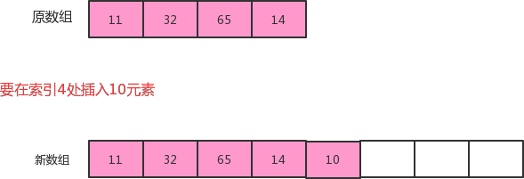

2、移除元素时：

移除元素时，应该检查当前数组的大小是否太大，比如正在用 100 个容量的数组存储 10 个元素，这样就会造成内存空间的浪费，应该创建一个容量更小的数组存储元素。如果我们发现数据元素的数量不足数组容量的 1/4，则创建一个是原数组容量的 1/2 的新数组存储元素。

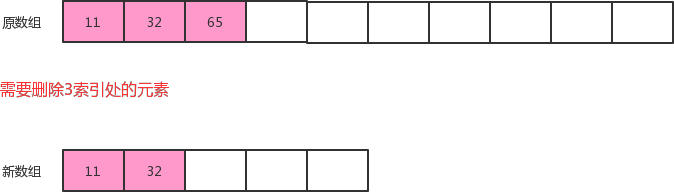

**顺序表的容量可变代码**：

```java
public class SequenceList<T> implements Iterable<T>{
    //存储元素的数组
    private T[] eles;
    //记录当前顺序表中元素的个数
    private int N;

    //其余方法的代码与上面一样

    //向线性表中添加元素t
    public void insert(T t){
        /*if (N==eles.length)
            throw new RuntimeException("当前表已满");*/

        if (N==eles.length)
            reSize(2*eles.length);

        eles[N++]=t;
    }

    //在i元素处插入元素t
    public void insert(int i,T t){
        /*if (i==eles.length){
            throw new RuntimeException("当前表已满");
        }*/
        if (i<0 || i>N){
            throw new RuntimeException("插入的位置不合法");
        }

        if (N==eles.length)
            reSize(2*eles.length);

        //先把i索引处的元素及其后面的元素一次向后移一位
        for (int index = N; index>i; index--){
            eles[index] = eles[index-1];
        }
        //再把t元素放 到i索引处即可
        eles[i]=t;
        N++;
    }

    //删除指定位置i处的元素，并返回该元素
    public T remove(int i){
        if (i<0 || i>N-1){
            throw new RuntimeException("当前要删除的元素不存在");
        }

        //记录索引i处的值
        T result=eles[i];
        //索引i后面的元素依次向前移动一位即可
        for (int index=i; index<N-1; index++){
            eles[index] = eles[index+1];
        }
        N--;

        if (N< eles.length/4)
            reSize(eles.length/2);

        return result;
    }

    //根据参数newSize，重置eles的大小
    public void reSize(int newSize){
        //定义一个临时数组，指向原数组
        T[] tmp=eles;

        //创建新数组
        eles=(T[])new Object[newSize];

        //把原数组的数据拷贝到新数组即可
        for (int i = 0; i < N; i++) {
            eles[i]=tmp[i];
        }
    }
}
```

测试代码：

```java
//测试代码
public class Test {
    public static void main(String[] args) throws Exception {
        SequenceList<String> squence = new SequenceList<>(5);
        //测试遍历
        squence.insert(0, "姚明");
        squence.insert(1, "科比");
        squence.insert(2, "麦迪");
        squence.insert(3, "艾佛森");
        squence.insert(4, "卡特");
        System.out.println(squence.capacity()); 
        
        squence.insert(5,"aa");
        System.out.println(squence.capacity());
        squence.insert(5,"aa");
        squence.insert(5,"aa");
        squence.insert(5,"aa");
        squence.insert(5,"aa");
        squence.insert(5,"aa");
        System.out.println(squence.capacity());
        
        squence.remove(1);
        squence.remove(1);
        squence.remove(1);
        squence.remove(1);
        squence.remove(1);
        squence.remove(1);
        squence.remove(1);
        System.out.println(squence.capacity());
    }
}
```

## 4、顺序表的时间复杂度

`get(i)`：不难看出，不论数据元素量 N 有多大，只需要一次 eles\[i\] 就可以获取到对应的元素，所以时间复杂度为 O(1)

`insert(int i,T t)`：每一次插入，都需要把 i 位置后面的元素移动一次，随着元素数量 N 的增大，移动的元素也越多，时间复杂为 O(n)

`remove(int i)`：每一次删除，都需要把 i 位置后面的元素移动一次，随着数据量 N 的增大，移动的元素也越多，时间复杂度为 O(n)

由于顺序表的底层由数组实现，数组的长度是固定的，所以在操作的过程中涉及到了容器扩容操作。这样会导致顺序表在使用过程中的时间复杂度不是线性的，在某些需要扩容的结点处，耗时会突增，尤其是元素越多，这个问题越明显

## 5、Java 中 ArrayList 实现

Java 中 ArrayList 集合的底层也是一种顺序表，使用数组实现，同样提供了增删改查以及扩容等功能。

查看源码验证以下三方面：

1. 是否用数组实现；

2. 有没有扩容操作；

3. 有没有提供遍历方式；

ArrayList 的部分源码：

```java
transient Object[] elementData; // non-private to simplify nested class access

public boolean add(E e) {
    ensureCapacityInternal(size + 1);  // Increments modCount!!
    elementData[size++] = e;
    return true;
}

private void ensureCapacityInternal(int minCapacity) {
    ensureExplicitCapacity(calculateCapacity(elementData, minCapacity));
}

private void ensureExplicitCapacity(int minCapacity) {
    modCount++;

    // overflow-conscious code
    if (minCapacity - elementData.length > 0)
        grow(minCapacity);
}

private void grow(int minCapacity) {
    // overflow-conscious code
    int oldCapacity = elementData.length;
    int newCapacity = oldCapacity + (oldCapacity >> 1);
    if (newCapacity - minCapacity < 0)
        newCapacity = minCapacity;
    if (newCapacity - MAX_ARRAY_SIZE > 0)
        newCapacity = hugeCapacity(minCapacity);
    // minCapacity is usually close to size, so this is a win:
    elementData = Arrays.copyOf(elementData, newCapacity);
}

public Iterator<E> iterator() {
    return new Itr();
}

private class Itr implements Iterator<E> {
    Itr() {}

    public boolean hasNext() {
        return cursor != size;
    }

    @SuppressWarnings("unchecked")
    public E next() {
        checkForComodification();
        int i = cursor;
        if (i >= size)
            throw new NoSuchElementException();
        Object[] elementData = ArrayList.this.elementData;
        if (i >= elementData.length)
            throw new ConcurrentModificationException();
        cursor = i + 1;
        return (E) elementData[lastRet = i];
    }
}
```

Arrays 中 copyOf 方法的源码：

```java
public static <T> T[] copyOf(T[] original, int newLength) {
    return (T[]) copyOf(original, newLength, original.getClass());
}

public static <T,U> T[] copyOf(U[] original, int newLength, Class<? extends T[]> newType) {
    @SuppressWarnings("unchecked")
    T[] copy = ((Object)newType == (Object)Object[].class)
        ? (T[]) new Object[newLength]
        : (T[]) Array.newInstance(newType.getComponentType(), newLength);
    System.arraycopy(original, 0, copy, 0,
                     Math.min(original.length, newLength));
    return copy;
}
```

# 三、链表

## 1、概述

之前我们已经使用顺序存储结构实现了线性表，我们会发现虽然顺序表的查询很快，时间复杂度为 O(1)，但是增删的效率是比较低的，因为每一次增删操作都伴随着大量的数据元素移动。这个问题有没有解决方案呢？有，我们可以使用另外一种存储结构实现线性表——链式存储结构。

链表是一种物理存储单元上非连续、非顺序的存储结构，其物理结构不能表示数据元素的逻辑顺序，数据元素的逻辑顺序是通过链表中的指针链接次序实现的。链表由一系列的结点（链表中的每一个元素称为结点）组成，结点可以在运行时动态生成。

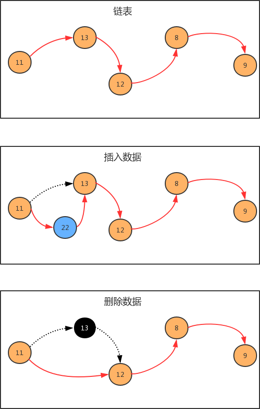

那我们如何使用链表呢？按照面向对象的思想，我们可以设计一个类，来描述结点这个事物，用一个属性描述这个结点存储的元素，用来另外一个属性描述这个结点的下一个结点。

**结点 API 设计**：

| 类名     | Node\<T>                                      |
| -------- | --------------------------------------------- |
| 构造方法 | Node(T t,Node next)：创建 Node 对象           |
| 成员变量 | T item：存储数据<br>Node next：指向下一个结点 |

**结点类实现**：

```java
public class Node<T> {
    //存储元素
    public T item;
    //指向下一个结点
    public Node next;
    
    public Node(T item, Node next) {
        this.item = item;
        this.next = next;
    }
}
```

**生成链表**：

```java
public static void main(String[] args) throws Exception {
    //构建结点
    Node<Integer> first = new Node<Integer>(11, null);
    Node<Integer> second = new Node<Integer>(13, null);
    Node<Integer> third = new Node<Integer>(12, null);
    Node<Integer> fourth = new Node<Integer>(8, null);
    Node<Integer> fifth = new Node<Integer>(9, null);
    
    //生成链表
    first.next = second;
    second.next = third;
    third.next = fourth;
    fourth.next = fifth;
}
```

## 2、单向链表

单向链表是链表的一种，它由多个结点组成，每个结点都由一个数据域和一个指针域组成，数据域用来存储数据，指针域用来指向其后继结点。链表的头结点的数据域不存储数据，指针域指向第一个真正存储数据的结点。

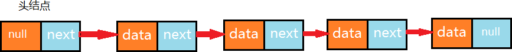

### 单向链表 API 设计


| 类名       | LinkList\<T>                                                 |
| ---------- | ------------------------------------------------------------ |
| 构造方法   | LinkList()：创建 LinkList 对象                               |
| 成员方法   | 1.  public void clear()：空置线性表<br>2.  publicboolean isEmpty()：判断线性表是否为空，是返回 true，否返回 false<br>3.public int length()：获取线性表中元素的个数<br>4.public T get(int i)：读取并返回线性表中的第 i 个元素的值<br>5.public void insert(T t)：往线性表中添加一个元素；<br>6.public void insert(int i,T t)：在线性表的第 i 个元素之前插入一个值为t的数据元素<br>7.public T remove(int i)：删除并返回线性表中第 i 个数据元素<br>8.public int indexOf(T t)：返回线性表中首次出现的指定元素的位序号，若不存在则返回 -1 |
| 成员内部类 | private class Node\<T>：结点类                               |
| 成员变量   | 1.private Node head：记录首结点<br>2.private int N：记录链表的长度 |

### 单向链表代码实现

```java
public class LinkList<T> implements Iterable<T>{
    //记录头结点
    private Node head;
    //记录链表的长度
    private int N;

    //节点类
    private class Node{
        //存储数据
        T item;
        //下一个结点
        Node next;

        public Node(T item,Node next){
            this.item=item;
            this.next=next;
        }
    }

    public LinkList() {
        //初始化头结点
        this.head=new Node(null,null);
        //初始化元素个数
        this.N=0;
    }

    //清空链表
    public void clear(){
        head.next=null;
        N=0;
    }

    //获取链表的长度
    public int length(){
        return N;
    }

    //判断链表是否为空
    public boolean isEmpty(){
        return N==0;
    }

    //获取指定位置i处的元素
    public T get(int i){
        if (i<0||i>=N){
        	throw new RuntimeException("位置不合法！");
        }

        //通过循环，从头节点开始往后找，依次找i次，就可以找到对应的元素
        Node n=head.next;
        for (int index = 0; index < i; index++) {
            n=n.next;
        }
        return n.item;
    }

    //向链表中添加元素t
    public void insert(T t){
        //找到最后一个结点
        Node n=head;
        while(n.next!=null){
            n=n.next;
        }

        //创建新结点
        Node newNode = new Node(t,null);
        //让当前最后一个结点指向新结点
        n.next=newNode;
        //元素的个数+1
        N++;
    }

    //向指定位置i处添加元素t
    public void insert(int i,T t){
        if (i<0||i>=N){
            throw new RuntimeException("位置不合法！");
        }

        //找到i位置的前一个节点
        Node pre = head;
        for (int index = 0; index <= i - 1; index++) {
            pre=pre.next;
        }

        //找到i位置的结点
        Node cur=pre.next;

        //创建新结点，并且新结点需要指向原来i位置的结点
        Node newNode=new Node(t,cur);

        //原来i位置的前一个结点指向新结点即可
        pre.next=newNode;

        //元素个数+1
        N++;
    }

    //删除指定位置i处的元素，并返回被删除的元素
    public T remove(int i){
        if (i<0 || i>=N){
        	throw new RuntimeException("位置不合法");
        }

        //找到i位置的前一个节点
        Node pre = head;
        for (int index = 0; index <= i - 1; index++) {
            pre=pre.next;
        }

        //找到i位置的结点
        Node cur=pre.next;

        //找到i位置的下一个结点
        Node nextNode = cur.next;

        //前一个结点指向下一个结点
        pre.next=nextNode;

        //元素个数-1
        N--;
        return cur.item;
    }

    //查找元素t在链表中第一次出现的位置
    public int indexOf(T t){
        //从头结点开始，依次找到每一个结点，取出item和t比较，如同相同则找到
        Node n=head;
        for (int i = 0; n.next!=null; i++) {
            n=n.next;
            if (n.item.equals(t)){
                return i;
            }
        }
        return -1;
    }
    
    @Override
    public Iterator<T> iterator() {
        return new LIterator();
    }

    public class LIterator implements Iterator{
        private Node n;
        public LIterator(){
            this.n=head;
        }

        @Override
        public boolean hasNext() {
            return n.next!=null;
        }

        @Override
        public Object next() {
            n=n.next;
            return n.item;
        }
    }
}
```

测试代码：

```java
//测试代码
public class Test {
    public static void main(String[] args) throws Exception {
        LinkList<String> list = new LinkList<>();
        list.insert(0,"张三");
        list.insert(1,"李四");
        list.insert(2,"王五");
        list.insert(3,"赵六");
        
        for (String s : list) {
        	System.out.println(s);
        }
        //测试length方法
        System.out.println(list.length());
        //测试get方法
        System.out.println(list.get(2));
        //测试remove方法
        String remove = list.remove(1);
        System.out.println(remove);
        System.out.println(list.length());
        
        for (String s : list) {
        	System.out.println(s);
        }
    }
}
```

## 3、双向链表

双向链表也叫双向表，是链表的一种，它由多个结点组成，每个结点都由一个数据域和两个指针域组成，数据域用来存储数据，其中一个指针域用来指向其后继结点，另一个指针域用来指向前驱结点。链表的头结点的数据域不存储数据，指向前驱结点的指针域值为 null，指向后继结点的指针域指向第一个真正存储数据的结点。

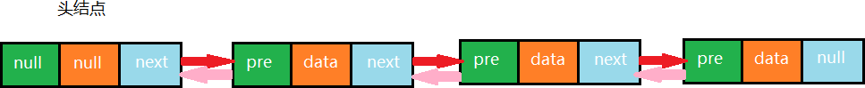

按照面向对象的思想，我们需要设计一个类，来描述结点这个事物。由于结点是属于链表的，所以我们把结点类作为链表类的一个内部类来实现

### 结点API设计


| 类名     | Node\<T>                                                     |
| -------- | ------------------------------------------------------------ |
| 构造方法 | Node(T t,Node pre,Node next)：创建 Node 对象                 |
| 成员变量 | T item：存储数据<br>Node next：指向下一个结点<br>Node pre：指向上一个结点 |

### 双向链表 API 设计


| 类名       | TwoWayLinkList\<T>                                           |
| ---------- | ------------------------------------------------------------ |
| 构造方法   | TwoWayLinkList()：创建 TwoWayLinkList 对象                   |
| 成员方法   | 1.  public void clear()：空置线性表<br>2.  publicboolean isEmpty()：判断线性表是否为空，是返回 true，否返回 false<br>3.  public int length()：获取线性表中元素的个数<br>4.  public T get(int i)：读取并返回线性表中的第 i 个元素的值<br>5.  public void insert(T t)：往线性表中添加一个元素<br>6.  public void insert(int i,T t)：在线性表的第 i 个元素之前插入一个值为 t 的数据元素<br>7.  public T remove(int i)：删除并返回线性表中第 i 个数据元素<br>8.  public int indexOf(T t)：返回线性表中首次出现的指定的数据元素的位序号，若不存在，则返回 -1<br>9.  public T getFirst()：获取第一个元素<br>10.public T getLast()：获取最后一个元素 |
| 成员内部类 | private class Node\<T>：结点类                               |
| 成员变量   | 1.private Node first：记录首结点<br>2.private Node  last：记录尾结点<br>3.private int N：记录链表的长度 |

### 双向链表代码实现

```java
import java.util.Iterator;

public class TwoWayLinkList<T> implements Iterable<T>{
    //首结点
    private Node head;
    //最后一个结点
    private Node last;
    //链表的长度
    private int N;

    //结点类
    private class Node<T>{
        //存储数据
        public T item;
        //指向上一个结点
        public Node pre;
        //指向下一个结点
        public Node next;

        public Node(T item, Node pre, Node next) {
            this.item = item;
            this.pre = pre;
            this.next = next;
        }
    }

    public TwoWayLinkList() {
        //初始化头节点和尾结点
        this.head=new Node(null,null,null);
        this.last=null;
        //初始化元素个数
        this.N=0;
    }

    //清空链表
    public void clear(){
        this.head.next=null;
        //this.head.pre=null;
        //this.head.item=null;
        this.last=null;
        N=0;
    }

    //获取链表长度
    public int length(){
        return N;
    }

    //判断链表是否为空
    public boolean isEmpty(){
        return N==0;
    }

    //获取第一个元素
    public T getFirst(){
        if (isEmpty()){
            return null;
        }
        return (T) head.next.item;
    }

    //获取最后一个元素
    public T getLast(){
        if (isEmpty()){
            return null;
        }
        return (T) last.item;
    }

    //插入元素t
    public void insert(T t){
        //如果链表为空
        if (isEmpty()){
            //创建新的结点
            Node newNode = new Node(t, head, null);

            //让新结点成为尾结点
            last=newNode;

            //让头结点指向尾结点
            head.next=last;
        }else {
            //如果链表不为空
            //创建新的结点
            Node<T> newNode = new Node<>(t, last, null);

            //让当前的尾结点指向新结点
            last.next=newNode;

            //让新结点成为尾结点
            last=newNode;
        }

        //元素个数+1
        N++;
    }

    //向指定位置i处插入元素t
    public void insert(int i,T t){
        if (i<0 || i>=N){
        	throw new RuntimeException("位置不合法");
        }

        //找到i位置的前一个结点
        Node preNode=head;
        for (int index = 0; index < i; index++) {
            preNode=preNode.next;
        }
        //找到i位置的结点
        Node cur=preNode.next;
        //创建新结点
        Node newNode = new Node(t,preNode,cur);
        //让i位置的前一个结点的next结点指向新结点
        preNode.next=newNode;
        //让i位置的后一个结点的pre结点指向新结点
        cur.pre=newNode;
        //元素个数+1
        N++;
    }

    //获取指定位置i处的元素
    public T get(int i){
        if (i<0||i>=N){
            throw new RuntimeException("位置不合法");
		}

        Node n=head.next;
        for (int index = 0; index < i; index++) {
            n=n.next;
        }
        return (T) n.item;
    }

    //找到元素t在链表中第一次出现的位置
    public int indexOf(T t){
        Node n=head;
        for (int i = 0; n.next!=null; i++) {
            n=n.next;
            if (n.item.equals(t)){
                return i;
            }
        }
        return -1;
    }

    //删除位置i处的元素，并返回该元素
    public T remove(int i){
        if (i<0 || i>=N){
            throw new RuntimeException("位置不合法");
		}

        //找到i位置的前一个结点
        Node preNode=head;
        for (int index = 0; index < i; index++) {
            preNode=preNode.next;
        }
        //找到i位置的结点
        Node cur=preNode.next;
        //找到i位置的下一个结点
        Node nextNode = cur.next;
        //让i位置的前一个结点的next指向i位置的下一个结点
        preNode.next=nextNode;
        //让i位置的下一个结点的pre指向i位置的前一个结点
        nextNode.pre=preNode;
        //元素个数-1
        N--;
        return (T) cur.item;
    }

    @Override
    public Iterator<T> iterator() {
        return new TIterator();
    }

    private class TIterator implements Iterator{
        private Node n;

        public TIterator() {
            this.n=head;
        }

        @Override
        public boolean hasNext() {
            return n.next!=null;
        }

        @Override
        public Object next() {
            n=n.next;
            return n.item;
        }
    }
}
```

测试代码：

```java
//测试代码
public class Test {
    public static void main(String[] args) throws Exception {
        TwoWayLinkList<String> list = new TowWayLinkList<>();
        list.insert("乔峰");
        list.insert("虚竹");
        list.insert("段誉");
        list.insert(1,"鸠摩智");
        list.insert(3,"叶二娘");
        for (String str : list) {
        	System.out.println(str);
        }

        String two = list.get(2);
        System.out.println(two);

        String remove = list.remove(3);
        System.out.println(remove);
        System.out.println(list.length());

        System.out.println(list.getFirst());
        System.out.println(list.getLast());
    }
}
```

### Java 中 LinkedList 实现

Java 中 LinkedList 集合也是使用双向链表实现，并提供了增删改查等相关方法

查看 LinkeedList 源码验证以下两方面：

1. 底层是否用双向链表实现；

2. 结点类是否有三个域

LinkedList 的部分源码：

```java
transient Node<E> first;
transient Node<E> last;

public boolean add(E e) {
    linkLast(e);
    return true;
}

void linkLast(E e) {
    final Node<E> l = last;
    final Node<E> newNode = new Node<>(l, e, null);
    last = newNode;
    if (l == null)
        first = newNode;
    else
        l.next = newNode;
    size++;
    modCount++;
}

private static class Node<E> {
    E item;
    Node<E> next;
    Node<E> prev;

    Node(Node<E> prev, E element, Node<E> next) {
        this.item = element;
        this.next = next;
        this.prev = prev;
    }
}
```

## 4、链表的复杂度分析

`get(int i)`：每一次查询，都需要从链表的头部开始，依次向后查找，随着数据元素 N 的增多，比较的元素越多，时间复杂度为 O(n)

`insert(int i,T t)`：每一次插入，需要先找到 i 位置的前一个元素，然后完成插入操作，随着数据元素 N 的增多，查找的元素越多，时间复杂度为 O(n);

`remove(int i)`：每一次移除，需要先找到 i 位置的前一个元素，然后完成删除操作，随着数据元素 N 的增多，查找的元素越多，时间复杂度为 O(n)

相比较顺序表，链表插入和删除的时间复杂度虽然一样，但仍然有很大的优势，因为链表的物理地址是不连续的，它不需要预先指定存储空间大小，或者在存储过程中涉及到扩容等操作，同时它并没有涉及到元素的交换。

相比较顺序表，链表的查询操作性能会比较低。因此，如果我们的程序中查询操作比较多，建议使用顺序表，增删操作比较多，建议使用链表。

## 5、链表反转

单链表的反转，是面试中的一个高频题目。

需求：

原链表中数据为：1-\>2-\>3\>4

反转后链表中数据为：4-\>3-\>2-\>1

**反转 API**：

```java
public void reverse():对整个链表反转
```

```java
public Node reverse(Nodee curr)：反转链表中的某个结点 curr，并把反转后的 curr 结点返回
```

使用递归可以完成反转，递归反转其实就是从原链表的第一个存数据的结点开始，依次递归调用反转每一个结点，直到把最后一个结点反转完毕，整个链表就反转完毕。

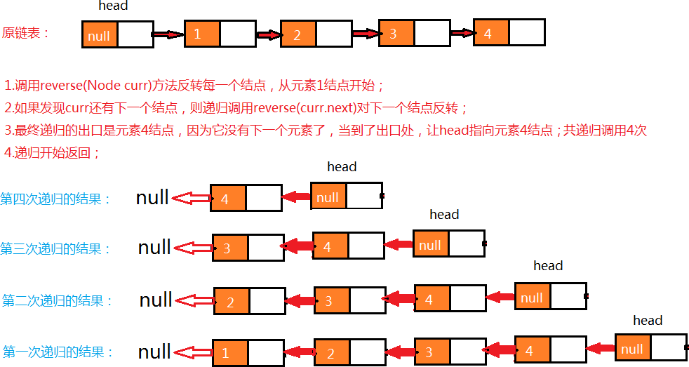

**代码**：

在单链表 LinkList 的代码中添加 reverse 方法：

```java
public class LinkList<T> implements Iterable<T>{
    //其余代码见单向链表代码实现部分
    
    //用来反转整个链表
    public void reverse(){
        //判断当前链表是否为空，如果为空则结束运行，如果不是则调用重载的reverse方法进行反转
        if (isEmpty()){
            return;
        }
        reverse(head.next);
    }

    //反转指定的结点cur，并把反转后的结点返回
    public Node reverse(Node cur){
        if (cur.next==null){
            head.next=cur;
            return cur;
        }
        //递归反转当前结点的下一个结点，返回值就是链表反转后当前节点的上一个结点
        Node preNode=reverse(cur.next);
        //让返回的结点的next指向当前结点cur
        preNode.next=cur;
        //让当前结点的next指向null
        cur.next=null;
        return cur;
    }
}
```

测试：

```java
public class LinkListTest2 {
    public static void main(String[] args) {
        //创建单向链表对象
        LinkList<String> sl = new LinkList<>();

        //测试插入
        sl.insert("姚明");
        sl.insert("科比");
        sl.insert("麦迪");
        sl.insert(1,"艾弗森");
        System.out.println(sl);
        for (String s : sl) {
            System.out.println(s);
        }

        System.out.println("------------");

        sl.reverse();
        for (String s : sl) {
            System.out.println(s);
        }
    }
}
```

## 6、快慢指针

快慢指针指的是定义两个指针，这两个指针的移动速度一块一慢，以此来制造出自己想要的差值，这个差值可以帮我们找到链表上相应的结点。一般情况下，快指针的移动步长为慢指针的两倍

### 中间值问题

我们先来看下面一段代码，然后完成需求。

```java
//测试类
public class Test {
    public static void main(String[] args) throws Exception {
        Node<String> first = new Node<>("aa", null);
        Node<String> second = new Node<>("bb", null);
        Node<String> third = new Node<>("cc", null);
        Node<String> fourth = new Node<>("dd", null);
        Node<String> fifth = new Node<>("ee", null);
        Node<String> six = new Node<>("ff", null);
        //Node<String> seven = new Node<>("gg", null);
        
        //完成结点之间的指向
        first.next = second;
        second.next = third;
        third.next = fourth;
        fourth.next = fifth;
        fifth.next = six;
        //six.next = seven;
        
        //查找中间值
        String mid = getMid(first);
        System.out.println("中间值为："+mid);
    }
    
    /**
    * @param first 链表的首结点
    * @return 链表的中间结点的值
    */
    public static String getMid(Node<String> first) {
    	return null;
    }
    
    //结点类
    private static class Node<T> {
        //存储数据
        T item;
        //下一个结点
        Node next;
        public Node(T item, Node next) {
            this.item = item;
            this.next = next;
        }
    }
}
```

**需求**：

请完善测试类 Test 中的 getMid 方法，可以找出链表的中间元素值并返回。

利用快慢指针，我们把一个链表看成一个跑道，假设 a 的速度是 b 的两倍，那么当 a 跑完全程后，b 刚好跑一半，以此来达到找到中间节点的目的。

如下图，最开始，slow 与 fast 指针都指向链表第一个节点，然后 slow 每次移动一个指针，fast 每次移动两个指针。

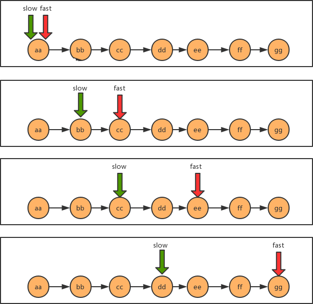

**代码**：

```java
public static String getMid(Node<String> first) {
    //定义两个指针
    Node<String> fast=first;
    Node<String> slow=first;
    //使用两个指针遍历链表，当快指针指向的结点没有下一个结点了就可以结束
    //结束后满指针指向的结点就是中间值
    //偶数个结点最后fast==null，奇数个结点最后fast.next==null
    while (fast!=null && fast.next!=null){
        //变化fast和slow的值
        fast=fast.next.next;
        slow=slow.next;
    }

    return slow.item;
}
```

### 单向链表是否有环问题

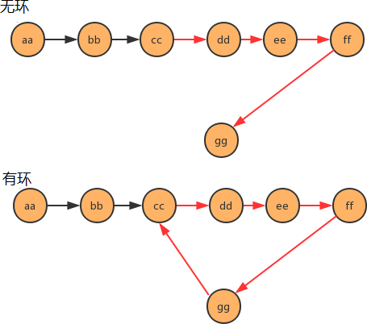

看下面代码，完成需求：

```java
//测试类
public class Test {
    public static void main(String[] args) throws Exception {
        Node<String> first = new Node<String>("aa", null);
        Node<String> second = new Node<String>("bb", null);
        Node<String> third = new Node<String>("cc", null);
        Node<String> fourth = new Node<String>("dd", null);
        Node<String> fifth = new Node<String>("ee", null);
        Node<String> six = new Node<String>("ff", null);
        Node<String> seven = new Node<String>("gg", null);
        
        //完成结点之间的指向
        first.next = second;
        second.next = third;
        third.next = fourth;
        fourth.next = fifth;
        fifth.next = six;
        six.next = seven;
        
        //产生环
        seven.next = third;
        
        //判断链表是否有环
        boolean circle = isCircle(first);
        System.out.println("first链表中是否有环："+circle);
    }
    
    /**
    * 判断链表中是否有环
    * @param first 链表首结点
    * @return ture为有环，false为无环
    */
    public static boolean isCircle(Node<String> first) {
    	return false;
    }
    
    //结点类
    private static class Node<T> {
        //存储数据
        T item;
        //下一个结点
        Node next;
        public Node(T item, Node next) {
            this.item = item;
            this.next = next;
        }
    }
}
```

**需求**：

请完善测试类 Test 中的 isCircle 方法，返回链表中是否有环。

使用快慢指针的思想，还是把链表比作一条跑道，链表中有环，那么这条跑道就是一条圆环跑道，在一条圆环跑道中，两个人有速度差，那么迟早两个人会相遇，只要相遇那么就说明有环。

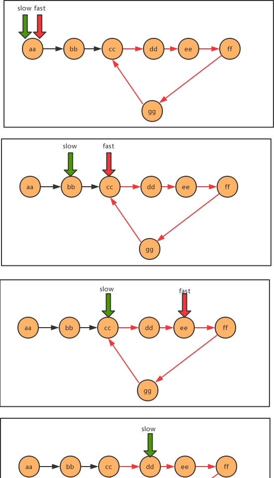

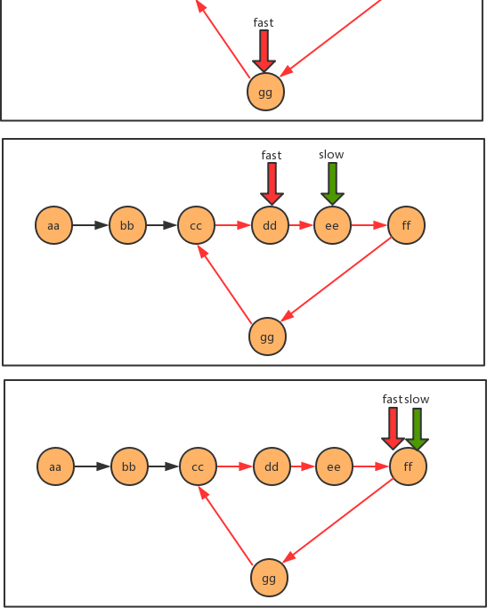

**代码**：

```java
public static boolean isCircle(Node<String> first) {
    //定义快慢指针
    Node<String> fast = first;
    Node<String> slow = first;

    //遍历链表，如果快慢指针指向了同一结点，那么证明有环
    while (fast!=null && fast.next!=null){
        //变换fast和slow
        fast = fast.next.next;
        slow = slow.next;

        if (fast.equals(slow)){
            return true;
        }
    }

    return false;
}
```

### 有环链表入口问题

同样看下面这段代码，完成需求：

```java
//测试类
public class Test {
    public static void main(String[] args) throws Exception {
        Node<String> first = new Node<>("aa", null);
        Node<String> second = new Node<>("bb", null);
        Node<String> third = new Node<>("cc", null);
        Node<String> fourth = new Node<>("dd", null);
        Node<String> fifth = new Node<>("ee", null);
        Node<String> six = new Node<>("ff", null);
        Node<String> seven = new Node<>("gg", null);
        
        //完成结点之间的指向
        first.next = second;
        second.next = third;
        third.next = fourth;
        fourth.next = fifth;
        fifth.next = six;
        six.next = seven;
        
        //产生环
        seven.next = third;
        
        //查找环的入口结点
        Node<String> entrance = getEntrance(first);
        if (entrance==null){
            System.out.println("该链表无环");
        }else {
            System.out.println("链表中环的入口结点元素为："+entrance.item);
        }
    }
    
    /**
    * 查找有环链表中环的入口结点
    * @param first 链表首结点
    * @return 环的入口结点
    */
    public static Node getEntrance(Node<String> first) {
    	return null;
    }
    
    //结点类
    private static class Node<T> {
        //存储数据
        T item;
        //下一个结点
        Node next;
        public Node(T item, Node next) {
            this.item = item;
            this.next = next;
        }
    }
}
```

**需求**：

请完善 Test 类中的 getEntrance 方法，查找有环链表中环的入口结点。

当快慢指针相遇时，我们可以判断到链表中有环，这时重新设定一个新指针指向链表的起点，且步长与慢指针一样为 1，则慢指针与"新"指针相遇的地方就是环的入口。证明这一结论牵涉到数论的知识，这里略，只讲实现。

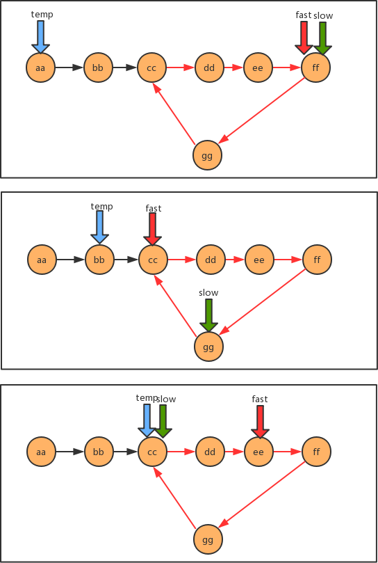

**代码**：

```java
public static Node getEntrance(Node<String> first) {
    //定义快慢指针
    Node<String> fast = first;
    Node<String> slow = first;
    //准备一个临时指针
    Node<String> temp = null;

    //遍历链表，先找到快慢指针相遇的地方，让临时指针指向链表首结点
    //继续遍历，知道慢指针和临时指针相遇，相遇时所指向的结点就是环的入口
    while (fast!=null && fast.next!=null){
        //变换快慢指针
        fast = fast.next.next;
        slow = slow.next;

        //判断快慢指针是否相遇
        if (fast.equals(slow)){
            temp=first;
            continue;
        }

        //让临时指针变换
        if (temp!=null){
            temp = temp.next;
            //判断临时指针是否和慢指针相遇
            if (temp.equals(slow)){
                break;
            }
        }
    }

    return temp;
}
```

## 7、循环链表

 循环链表，顾名思义，链表整体要形成一个圆环状。在单向链表中，最后一个节点的指针为 null，不指向任何结点，因为没有下一个元素了。要实现循环链表，我们只需要让单向链表的最后一个节点的指针指向头结点即可。

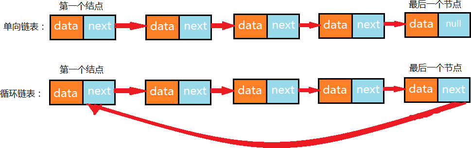

**循环链表的构建**：

```java
public class Test {
    public static void main(String[] args) throws Exception {
        //构建结点
        Node<Integer> first = new Node<Integer>(1, null);
        Node<Integer> second = new Node<Integer>(2, null);
        Node<Integer> third = new Node<Integer>(3, null);
        Node<Integer> fourth = new Node<Integer>(4, null);
        Node<Integer> fifth = new Node<Integer>(5, null);
        Node<Integer> six = new Node<Integer>(6, null);
        Node<Integer> seven = new Node<Integer>(7, null);

        //构建单链表
        first.next = second;
        second.next = third;
        third.next = fourth;
        fourth.next = fifth;
        fifth.next = six;
        six.next = seven;
        
        //构建循环链表,让最后一个结点指向第一个结点
        seven.next = first;
    }
}
```

## 8、约瑟夫问题

**问题描述**：

传说有这样一个故事，在罗马人占领乔塔帕特后，39 个犹太人与约瑟夫及他的朋友躲到一个洞中。39 个犹太人决定宁愿死也不要被敌人抓到，于是决定了一个自杀方式，41 个人排成一个圆圈，第一个人从 1 开始报数，依次往后，如果有人报数到 3，那么这个人就必须自杀，然后再由他的下一个人重新从 1 开始报数，直到所有人都自杀身亡为止。然而约瑟夫和他的朋友并不想遵从。于是，约瑟夫要他的朋友先假装遵从，他将朋友与自己安排在第 16个与第 31 个位置，从而逃过了这场死亡游戏。

**问题转换**：

41 个人坐一圈，第一个人编号为 1，第二个人编号为 2，第 n 个人编号为 n。

1.  编号为 1 的人开始从 1 报数，依次向后，报数为 3 的那个人退出圈；

2.  自退出那个人开始的下一个人再次从 1 开始报数，以此类推；

3.  求出最后退出的那个人的编号。

**图示**：

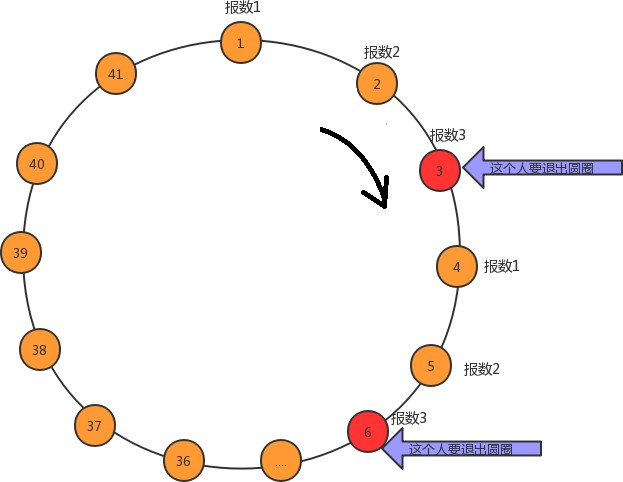

**解题思路**：

1.  构建含有 41 个结点的单向循环链表，分别存储 1\~41 的值，分别代表这 41 个人

2.  使用计数器 count，记录当前报数的值

3.  遍历链表，每循环一次，count++

4.  判断 count 的值，如果是 3，则从链表中删除这个结点并打印结点的值，把 count 重置为 0

**代码**：

```java
public class JosephTest {
    //解决约瑟夫问题
    public static void main(String[] args) {
        //构建循环链表，包含41个结点，分别存储1~41之间的值
        //用来记录首结点
        Node<Integer> first = null;
        //用来记录前一个结点
        Node<Integer> pre = null;

        for (int i = 1; i <= 41; i++) {
            //如果是第一个结点
            if (i==1){
                first = new Node<>(i,null);
                pre = first;
                continue;
            }

            //如果不是第一个结点
            Node<Integer> newNode = new Node<>(i, null);
            pre.next=newNode;
            pre=newNode;

            //如果是最后一个结点，需要让最后一个结点的下一个结点变为first
            if (i==41)
                pre.next=first;
        }

        //用count计数器模拟报数
        int count = 0;

        //遍历循环链表
        //记录每次遍历拿到的结点，默认从首结点开始
        Node<Integer> cur = first;
        //记录当前结点的上一个结点
        Node<Integer> before = null;
        while (cur!=cur.next){
            //模拟报数
            count++;

            //判断当前报数是不是为3
            if (count==3){
                //如果是3，把当前结点删除，打印当前节点，重置count=0，让当前结点n后移
                before.next=cur.next;
                System.out.print(cur.item+",");
                count=0;
                cur=cur.next;
            }else {
                //如果不是3，让before变为当前结点，让当前节点后移
                before=cur;
                cur=cur.next;
            }
        }

        //打印最后一个元素
        System.out.println(cur.item);
    }

    //结点类
    private static class Node<T> {
        //存储数据
        T item;
        //下一个结点
        Node next;
        public Node(T item, Node next) {
            this.item = item;
            this.next = next;
        }
    }
}
```

# 四、栈

## 1、栈概述

生活中的栈：存储货物或供旅客住宿的地方，可引申为仓库、中转站。例如我们现在生活中的酒店，在古时候叫客栈，是供旅客休息的地方，旅客可以进客栈休息，休息完毕后就离开客栈。

计算机中的栈：我们把生活中的栈的概念引入到计算机中，就是供数据休息的地方，它是一种数据结构，数据既可以进入到栈中，又可以从栈中出去。

栈是一种基于先进后出（FILO）的数据结构，是一种只能在一端进行插入和删除操作的特殊线性表。它按照先进后出的原则存储数据，先进入的数据被压入栈底，最后的数据在栈顶，需要读数据的时候从栈顶开始弹出数据（最后一个数据被第一个读出来）。

我们称数据进入到栈的动作为**压栈**，数据从栈中出去的动作为**弹栈**。

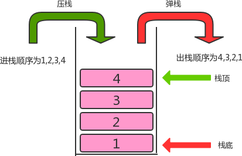

## 2、栈的实现

### 栈 API 设计

| 类名       | Stack\<T>                                                    |
| ---------- | ------------------------------------------------------------ |
| 构造方法   | Stack()：创建 Stack 对象                                     |
| 成员方法   | 1. public boolean isEmpty()：判断栈是否为空，是返回 true，否返回 false<br/>2. public int size()：获取栈中元素的个数<br/>3.  public T pop()：弹出栈顶元素<br/>4.  public void push(T t)：向栈中压入元素 t |
| 成员变量   | 1.private Node head：记录首结点<br/>2.private int N：当前栈的元素个数 |
| 成员内部类 | private class Node：结点类                                   |

### 栈代码实现

```java
import java.util.Iterator;

public class Stack<T> implements Iterable<T>{
    //记录首结点
    private Node head;
    //栈中元素的个数
    private int N;

    private class Node{
        public T item;
        public Node next;

        public Node(T item, Node next) {
            this.item = item;
            this.next = next;
        }
    }

    public Stack() {
        this.head=new Node(null,null);
        this.N=0;
    }

    //判断当前栈中元素个数是否为0
    public boolean isEmpty(){
        return N==0;
    }

    //获取栈中元素的个数
    public int size(){
        return N;
    }

    //把t元素压入栈
    public void push(T t){
        //找到首结点指向的第一个结点
        Node oldFirst = head.next;
        //创建新结点
        Node newNode = new Node(t, null);
        //让首结点指向新结点
        head.next = newNode;
        //让新结点指向原来的第一个结点
        newNode.next=oldFirst;
        //元素个数+1
        N++;
    }

    //弹出栈顶元素
    public T pop(){
        //找到首结点指向的第一个结点
        Node oldFirst = head.next;
        if (oldFirst==null){
            return null;
        }
        //让首结点指向原来第一个节点的下一个结点
        head.next = oldFirst.next;
        //元素个数-1
        N--;
        return oldFirst.item;
    }

    @Override
    public Iterator<T> iterator() {
        return new SIterator();
    }

    private class SIterator implements Iterator{
        private Node n;

        public SIterator(){
            this.n=head;
        }

        @Override
        public boolean hasNext() {
            return n.next!=null;
        }

        @Override
        public Object next() {
            n=n.next;
            return n.item;
        }
    }
}
```

测试代码：

```java
public class StackTest {
    public static void main(String[] args) {
        //创建栈对象
        Stack<String> stack = new Stack<>();

        //测试压栈
        stack.push("a");
        stack.push("b");
        stack.push("c");
        stack.push("d");

        for (String item : stack) {
            System.out.println(item);
        }
        System.out.println("-------------");

        //测试弹栈
        String result = stack.pop();
        System.out.println("弹出的元素是："+result);
        System.out.println("剩余的元素个数："+stack.size());
    }
}
```

## 3、案例

### 括号匹配问题

**问题描述**：

```
给定一个字符串，里边可能包含"()"小括号和其他字符，请编写程序检查该字符串的中的小括号是否成对出现。
例如：
    "(上海)(长安)"：正确匹配
    "上海((长安))"：正确匹配
    "上海(长安(北京)(深圳)南京)":正确匹配
    "上海(长安))"：错误匹配
    "((上海)长安"：错误匹配
```

**示例代码**：

```java
public class BracketsMatch {
    public static void main(String[] args) {
        String str = "(上海(长安)())";
        boolean match = isMatch(str);
        System.out.println(str+"中的括号是否匹配："+match);
    }
    
    /**
    * 判断str中的括号是否匹配
    * @param str 括号组成的字符串
    * @return 如果匹配，返回true，如果不匹配，返回false
    */
    public static boolean isMatch(String str){
        return false;
    }
}
```

请完善 isMath 方法。

**分析**：

1. 创建一个栈用来存储左括号
2. 从左往右遍历字符串，拿到每一个字符
3. 判断该字符是不是左括号，如果是，放入栈中存储
4. 判断该字符是不是右括号，如果不是，继续下一次循环
5. 如果该字符是右括号，则从栈中弹出一个元素 t
6. 判断元素 t 是否为 null，如果不是，则证明有对应的左括号，如果是，则证明没有对应的左括号
7. 循环结束后，判断栈中还有没有剩余的左括号，如果有，则不匹配，如果没有，则匹配

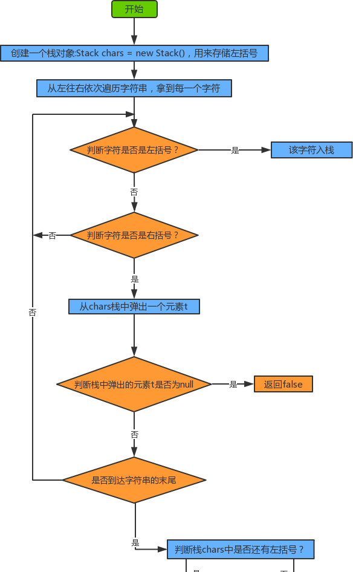

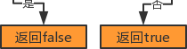

**代码实现**：

```java
public static boolean isMatch(String str){
    //1.创建栈对象，用来存储左括号
    Stack<String> chars = new Stack<>();
    //2.从左往右遍历字符串
    for (int i = 0; i < str.length(); i++) {
        String currChar = str.charAt(i)+"";

        //3.判断当前字符是否为左括号，如果是，则把字符放入到栈中
        if (currChar.equals("(")){
            chars.push(currChar);
        }else if (currChar.equals(")")){
            //4.继续判断当前字符是否为右括号，如果不是，继续下一次循环
    		//如果是则从栈中弹出一个左括号，并判断弹出的结果是否为null
            String pop = chars.pop();
            //如果为null证明没有匹配的左括号，如果不为null则证明有匹配的左括号
            if (pop==null){
                return false;
            }
        }
    }

    //5.判断栈中还有没有剩余的左括号，如果有则证明括号不匹配
    if (chars.size()==0){
        return true;
    }else {
        return false;
    }
}
```

### 逆波兰表达式求值问题

逆波兰表达式求值问题是我们计算机中经常遇到的一类问题，要研究明白这个问题，首先我们得搞清楚什么是逆波兰表达式？要搞清楚逆波兰表达式，我们得从中缀表达式说起。

**中缀表达式**：

中缀表达式就是我们平常生活中使用的表达式，例如：1+3\*2，2-(1+3) 等等，中缀表达式的特点是：二元运算符总是置于两个操作数中间。

中缀表达式是人们最喜欢的表达式方式，因为简单易懂。但是对于计算机来说就不是这样了，因为中缀表达式的运算顺序不具有规律性。不同的运算符具有不同的优先级，如果计算机执行中缀表达式，需要解析表达式语义，做大量的优先级相关操作。

**逆波兰表达式（后缀表达式）**：

逆波兰表达式是波兰逻辑学家 J・卢卡西维兹（ J・Lukasewicz）于 1929 年首先提出的一种表达式的表示方法，后缀表达式的特点：运算符总是放在跟它相关的操作数之后。

| 中缀表达式 | 逆波兰表达式 |
| ---------- | ------------ |
| a+b        | ab+          |
| a+(b-c)    | abc-+        |
| a+(b-c)\*d | abc-d\*+     |
| a\*(b-c)+d | abc-\*d+     |

**需求**：

给定一个只包含加减乘除四种运算的逆波兰表达式的数组表示方式，求出该逆波兰表达式的结果。

完善 caculate 方法，计算出逆波兰表达式的结果。

```java
public class ReversePolishNotation {
    public static void main(String[] args) {
        //中缀表达式3*（17-15）+18/6的逆波兰表达式如下
        String[] notation = {"3", "17", "15", "-", "*","18", "6","/","+"};
        int result = calculate(notation);
        System.out.println("逆波兰表达式的结果为："+result);
    }

    /**
     * @param notation 逆波兰表达式的数组表示方式
     * @return 逆波兰表达式的计算结果
     */
    public static int calculate(String[] notation){
        return -1;
    }
}
```

**分析**：

1. 创建一个栈对象 oprands 存储操作数
2. 从左往右遍历逆波兰表达式，得到每一个字符串
3. 判断该字符串是不是运算符，如果不是，把该该操作数压入 oprands 栈中
4. 如果是运算符，则从 oprands 栈中弹出两个操作数 o1，o2
5. 使用该运算符计算 o1 和 o2，得到结果 result
6. 把该结果压入 oprands 栈中
7. 遍历结束后，拿出栈中最终的结果返回

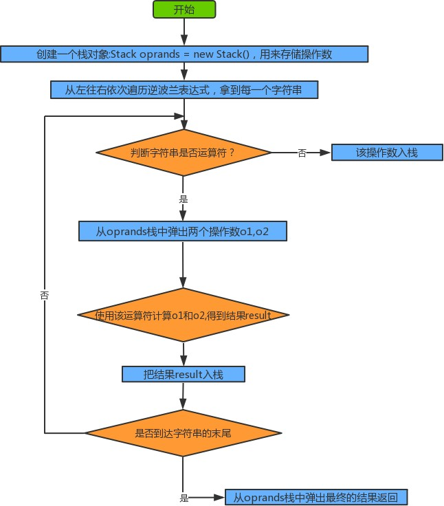

**代码实现**：

```java
public static int calculate(String[] notation){
    //1.定义一个栈，用来存储操作数
    Stack<Integer> operands = new Stack<>();
    //2.从左往右遍历每一个元素，得到每一个元素
    for (int i = 0; i < notation.length; i++) {
        String curr = notation[i];
        //3.判断当前元素是运算符还是操作数
        Integer o1;
        Integer o2;
        Integer result;
        switch (curr){
            //4.若是运算符，从栈中弹出两个操作数完成运算，运算完的结果再压入栈中
            case "+":
                o1 = operands.pop();
                o2 = operands.pop();
                result = o2 + o1;
                operands.push(result);
                break;
            case "-":
                o1 = operands.pop();
                o2 = operands.pop();
                result = o2 - o1;
                operands.push(result);
                break;
            case "*":
                o1 = operands.pop();
                o2 = operands.pop();
                result = o2 * o1;
                operands.push(result);
                break;
            case "/":
                o1 = operands.pop();
                o2 = operands.pop();
                result = o2 / o1;
                operands.push(result);
                break;
                //5.若是操作数，把该操作数压入到栈中
            default:
                operands.push(Integer.parseInt(curr));
                break;
        }
    }

    //6.得到栈中最后一个元素，就是逆波兰表达式的结果
    int result = operands.pop();
    return result;
}
```

# 五、队列

队列是一种基于先进先出（FIFO）的数据结构，是一种只能在一端进行插入，在另一端进行删除操作的特殊线性表，它按照先进先出的原则存储数据，先进入的数据，在读取数据时先被读出来。

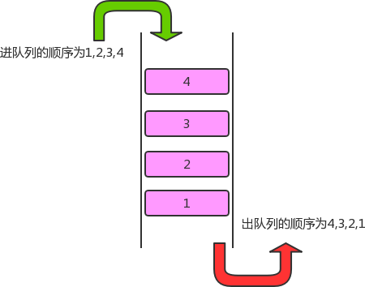

## 1、队列的 API 设计

| 类名       | Queue\<T>                                                    |
| ---------- | ------------------------------------------------------------ |
| 构造方法   | Queue()：创建 Queue 对象                                     |
| 成员方法   | 1.public boolean isEmpty()：判断队列是否为空，是返回 true，否返回 false<br/>2.public int size()：获取队列中元素的个数<br/>3.public T dequeue()：从队列中拿出一个元素<br/>4.public void enqueue(T t)：往队列中插入一个元素 |
| 成员变量   | 1.private Node head：记录首结点<br/>2.private int N：当前栈的元素个数<br/>3.private Node last：记录最后一个结点 |
| 成员内部类 | private class Node：结点类                                   |

## 2、队列的实现

```java
public class Queue<T> implements Iterable<T>{
    //记录首结点
    private Node head;
    //记录最后结点
    private Node last;
    //记录队列中元素的个数
    private int N;

    private class Node{
        public T item;
        public Node next;

        public Node(T item, Node next) {
            this.item = item;
            this.next = next;
        }
    }

    public Queue() {
        this.head=new Node(null,null);
        this.last=null;
        this.N=0;
    }

    //判断队列是否为空
    public boolean isEmpty(){
        return N==0;
    }

    //返回队列中元素的个数
    public int size(){
        return N;
    }

    //向队列中插入元素t
    public void enqueue(T t){
        //当前尾结点last为null
        if (last==null){
            last=new Node(t,null);
            head.next=last;
        }else{
            //当前尾结点last不为null
            Node newNode = new Node(t, null);
            last.next=newNode;
            last=newNode;
        }

        //元素个数+1
        N++;
    }

    //从队列中拿出一个元素
    public T dequeue(){
        if (isEmpty()){
            return null;
        }

        Node oldFirst = head.next;
        head.next=oldFirst.next;
        N--;

        //若队列中的元素出完了，需要重置last为null
        if (isEmpty()){
            last=null;
        }
        return oldFirst.item;
    }

    @Override
    public Iterator<T> iterator() {
        return new QIterator();
    }

    public class QIterator implements Iterator{
        private Node n;

        public QIterator() {
            this.n = head;
        }

        @Override
        public boolean hasNext() {
            return n.next!=null;
        }

        @Override
        public Object next() {
            n=n.next;
            return n.item;
        }
    }
}
```

测试：

```java
public class QueueTest {
    public static void main(String[] args) {
        //创建队列对象
        Queue<String> queue = new Queue<>();

        //测试队列的enqueue方法
        queue.enqueue("a");
        queue.enqueue("b");
        queue.enqueue("c");
        queue.enqueue("d");

        for (String str : queue) {
            System.out.println(str);
        }

        System.out.println("---------");

        //测试队列的dequeue方法
        String result = queue.dequeue();
        System.out.println("出队列的元素是："+result);
        System.out.println("剩余的元素个数："+queue.size());
    }
}
```

