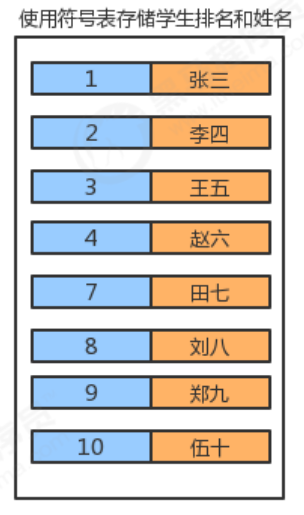

# 一、概述

符号表最主要的目的就是将一个键和一个值联系起来，符号表能够将存储的数据元素是一个键和一个值共同组成的 键值对数据，我们可以根据键来查找对应的值。



> 符号表中，键具有唯一性。 

符号表在实际生活中的使用场景是非常广泛的，见下表：

| 应用     | 查找目的                 | 键     | 值       |
| -------- | ------------------------ | ------ | -------- |
| 字典     | 找出单词的释义           | 单词   | 释义     |
| 图书索引 | 找出某个术语相关的页码   | 术语   | 一串页码 |
| 网络搜索 | 找出某个关键字对应的网页 | 关键字 | 网页名称 |

# 二、API 设计

结点类：

| 类名     | `Node<Key, Value>`                                           |
| -------- | ------------------------------------------------------------ |
| 构造方法 | `Node(Key key,Value value,Node next)`：创建 Node 对象        |
| 成员变量 | 1.`public Key key`：存储键<br/>2.`public Value value`：存储值<br/>3.`public Node next`：存储下一个结点 |

符号表：

| 类名     | `symbol.SymbolTable<Key, Value>`                             |
| -------- | ------------------------------------------------------------ |
| 构造方法 | `symbol.SymbolTable()`：创建 SymbolTable 对象                |
| 成员方法 | 1.`public Value get(Key key)`：根据键 key，找对应的值<br/>2.`public void put(Key key,Value val)`：向符号表中插入一个键值对<br/>3.`public void delete(Key key)`：删除键为 key 的键值对<br/>4.`public int size()`：获取符号表的大小 |
| 成员变量 | 1.`private Node head`：记录首结点<br/>2.`private int N`：记录符号表中键值对的个数 |

# 三、实现

```java
public class SymbolTable<Key, Value> {
    //记录首结点
    private Node head;
    //记录符号表中元素的个数
    private int N;

    private class Node{
        //键
        private Key key;
        //值
        private Value value;
        //下一个结点
        private Node next;

        public Node(Key key, Value value, Node next) {
            this.key = key;
            this.value = value;
            this.next = next;
        }
    }

    public SymbolTable() {
        this.head = new Node(null, null, null);
        this.N = 0;
    }

    //获取符号表中键值对的个数
    public int size() {
        return N;
    }

    //往符号表中插入键值对
    public void put(Key key, Value value) {
        //若符号表中已经存在键为key的键值对，只需找到该结点，替换值为value即可
        Node n = head;
        while (n.next != null) {
            n = n.next;
            //判断n结点存储的键是否为key，若是则替换value的值
            if (n.key.equals(key)) {
                n.value = value;
                return;
            }
        }

        //若不存在，需要创建新的结点，保存要插入的键值对，再把新结点插入到链表的头部
        Node newNode = new Node(key, value, head.next);
        head.next = newNode;
        //元素个数+1
        N++;
    }

    //删除符号表中键为key的键值对
    public void delete(Key key) {
        //找到键为key的结点，把该结点从链表中删除
        Node n = head;
        while (n.next != null) {
            //判断n结点的下一个结点的键是否为key，若是则删除该结点
            if (n.next.key.equals(key)) {
                n.next = n.next.next;
                N--;
                return;
            }

            n = n.next;
        }
    }

    //从符号表中获取key对应的值
    public Value get(Key key) {
        //找到键为key的结点
        Node n = head;
        while (n.next != null) {
            n = n.next;
            if (n.key.equals(key)) {
                return n.value;
            }
        }
        return null;
    }
}
```

测试类：

```java
public class SymbolTableTest {
    public static void main(String[] args) {
        SymbolTable<Integer, String> symbolTable = new SymbolTable<>();
        //测试put方法（插入，替换）
        symbolTable.put(1, "乔峰");
        symbolTable.put(2, "虚竹");
        symbolTable.put(3, "段誉");
        System.out.println("插入完毕后，元素个数为：" + symbolTable.size());

        symbolTable.put(2, "慕容复");
        System.out.println("替换完毕后，元素个数为：" + symbolTable.size());

        //测试get方法
        System.out.println("替换完毕后，键为2对应的值为：" + symbolTable.get(2));

        //测试删除方法
        symbolTable.delete(2);
        System.out.println("删除完毕后，元素的个数为：" + symbolTable.size());
    }
}
```

# 四、有序符号表

刚才实现的符号表，我们可以称之为无序符号表，因为在插入的时候，并没有考虑键值对的顺序，而在实际生活 中，有时候我们需要根据键的大小进行排序，插入数据时要考虑顺序，那么接下来我们就实现一下有序符号表。

和符号表的代码相比只是 put 方法不一样

```java
public class OrderSymbolTable<Key extends Comparable<Key>, Value> {
    //记录首结点
    private Node head;
    //记录符号表中元素的个数
    private int N;

    private class Node {
        //键
        private Key key;
        //值
        private Value value;
        //下一个结点
        private Node next;

        public Node(Key key, Value value, Node next) {
            this.key = key;
            this.value = value;
            this.next = next;
        }
    }

    public OrderSymbolTable() {
        this.head = new Node(null, null, null);
        this.N = 0;
    }

    //获取符号表中键值对的个数
    public int size() {
        return N;
    }

    //往符号表中插入键值对
    public void put(Key key, Value value) {
        //定义两个Node变量，分别记录当前结点和其上一个结点
        Node cur = head.next;
        Node pre = head;
        while (cur!=null && key.compareTo(cur.key) > 0) {
            pre = cur;
            cur = cur.next;
        }

        //如果当前结点cur的键和要插入的key一样，则替换
        if (cur != null && key.compareTo(cur.key) == 0) {
            cur.value = value;
            return;
        }

        //如果不一样，则把新结点插入到cur之前
        Node newNode = new Node(key, value, cur);
        pre.next = newNode;
        N++;
    }

    //删除符号表中键为key的键值对
    public void delete(Key key) {
        //找到键为key的结点，把该结点从链表中删除
        Node n = head;
        while (n.next != null) {
            //判断n结点的下一个结点的键是否为key，若是则删除该结点
            if (n.next.key.equals(key)) {
                n.next = n.next.next;
                N--;
                return;
            }

            n = n.next;
        }
    }

    //从符号表中获取key对应的值
    public Value get(Key key) {
        //找到键为key的结点
        Node n = head;
        while (n.next != null) {
            n = n.next;
            if (n.key.equals(key)) {
                return n.value;
            }
        }
        return null;
    }
}
```

测试代码：

可以通过调试模式观察符号表内部存储的数据

```java
public class OrderSymbolTableTest {
    public static void main(String[] args) {
        OrderSymbolTable<Integer, String> orderSymbolTable = new OrderSymbolTable<>();

        orderSymbolTable.put(1, "张三");
        orderSymbolTable.put(2, "李四");
        orderSymbolTable.put(4, "赵六");
        orderSymbolTable.put(7, "田七");

        orderSymbolTable.put(3,"王五");
    }
}
```

