之前我们实现的符号表中，不难看出，符号表的增删查操作，随着元素个数 N 的增多，其耗时也是线性增多的，时间复杂度都是 O(n)，为了提高运算效率，接下来我们学习树这种数据结构。

# 一、树的基本定义

树是我们计算机中非常重要的一种数据结构，同时使用树这种数据结构，可以描述现实生活中的很多事物，例如家谱、单位的组织架构、等等。

树是由 n（n >= 1）个有限结点组成一个具有层次关系的集合。把它叫做“树”是因为它看起来像一棵倒挂的树，也就是说它是根朝上，而叶朝下的。

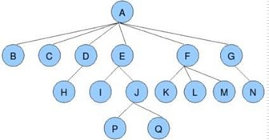

树具有以下特点：

* 每个结点有零个或多个子结点
* 没有父结点的结点为根结点
* 每一个非根结点只有一个父结点
* 每个结点及其后代结点整体上可以看做是一棵树，称为当前结点的父结点的一个子树

# 二、树的相关术语

**结点的度**：

> 一个结点含有的子树的个数称为该结点的度

**叶结点**：

> 度为 0 的结点称为叶结点，也可以叫做终端结点

**分支结点**：

> 度不为 0 的结点称为分支结点，也可以叫做非终端结点

**结点的层次**：

> 从根结点开始，根结点的层次为 1，根的直接后继层次为 2，以此类推

**结点的层序编号**：

> 将树中的结点，按照从上层到下层，同层从左到右的次序排成一个线性序列，把他们编成连续的自然数。

**树的度**：

> 树中所有结点的度的最大值

**树的高度（深度）**：

> 树中结点的最大层次

**森林**：

> m（m >= 0）个互不相交的树的集合，将一颗非空树的根结点删去，树就变成一个森林；给森林增加一个统一的根结点，森林就变成一棵树

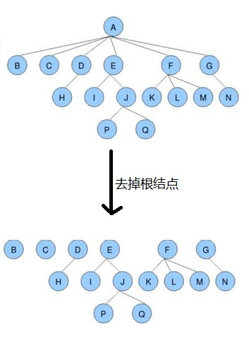

**孩子结点**：

> 一个结点的直接后继结点称为该结点的孩子结点

**双亲结点（父结点）**

> 一个结点的直接前驱称为该结点的双亲结点

**兄弟结点**：

> 同一双亲结点的孩子结点间互称兄弟结点

# 三、二叉树的基本定义

二叉树就是度不超过 2 的树（每个结点最多有两个子结点）

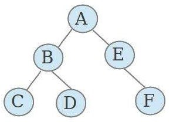

**满二叉树**：

一个二叉树，如果每一个层的结点树都达到最大值，则这个二叉树就是满二叉树。

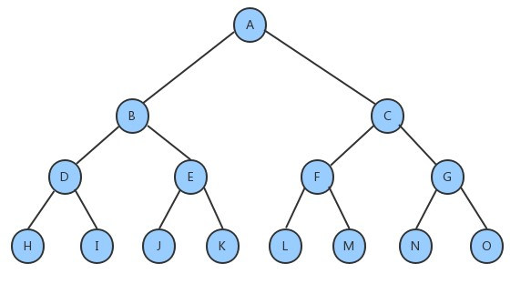

**完全二叉树**：

叶节点只能出现在最下层和次下层，并且最下面一层的结点都集中在该层最左边的若干位置的二叉树

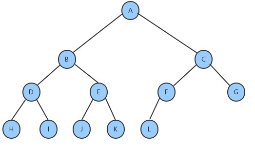

# 四、二叉查找树的创建

## 1、二叉树的结点类

根据对图的观察，我们发现二叉树其实就是由一个一个的结点及其之间的关系组成的，按照面向对象的思想，我们设计一个结点类来描述结点这个事物。

**结点类 API 设计**：

| 类名     | `Node<Key,Value>`                                            |
| -------- | ------------------------------------------------------------ |
| 构造方法 | `Node(Key key, Value value, Node left, Node right)`：创建 Node 对象 |
| 成员变量 | 1. `public Node left`：记录左子结点<br/>2. `public Node right`：记录右子结点<br/>3. `public Key key`：存储键<br/>4. `public Value value`：存储值 |

**代码实现**：

```java
private class Node<Key,Value>{
    //存储键
    public Key key;
    //存储值
    private Value value;
    //记录左子结点
    public Node left;
    //记录右子结点
    public Node right;
    
    public Node(Key key, Value value, Node left, Node right) {
        this.key = key;
        this.value = value;
        this.left = left;
        this.right = right;
    }
}
```

## 2、二叉查找树 API 设计

| 类名     | `BinaryTree<Key extends Comparable<Key>,Value value>`        |
| -------- | ------------------------------------------------------------ |
| 构造方法 | `BinaryTree()`：创建 BinaryTree 对象                         |
| 成员变量 | 1.`private Node root`：记录根结点<br/>2.`private int N`：记录树中元素的个数 |
| 成员方法 | 1.`public void put(Key key,Value value)`：向树中插入一个键值对<br/>2.`private Node put(Node x, Key key, Value value)`：给指定树 x 上添加一个键值对，并返回添加后的新树<br/>3.`public Value get(Key key)`：根据 key，从树中找出对应的值<br/>4.`private Value get(Node x, Key key)`：从指定的树 x 中找出 key 对应的值<br/>5.`public void delete(Key key)`：根据 key 删除树中对应的键值对<br/>6.`private Node delete(Node x, Key key)`：删除指定树 x 上键为 key 的键值对，并返回删除后的新树<br/>7.`public int size()`：获取树中元素的个数 |

## 3、二叉查找树实现

**插入方法 put 实现思想**：

1. 如果当前树中没有任何一个结点，则直接把新结点当做根结点使用
2. 如果当前树不为空，则从根结点开始：
   1. 如果新结点的 key 小于当前结点的 key，则继续找当前结点的左子结点
   2. 如果新结点的 key 大于当前结点的 key，则继续找当前结点的右子结点
   3. 如果新结点的 key 等于当前结点的 key，则树中已经存在这样的结点，替换该结点的 value 值即可

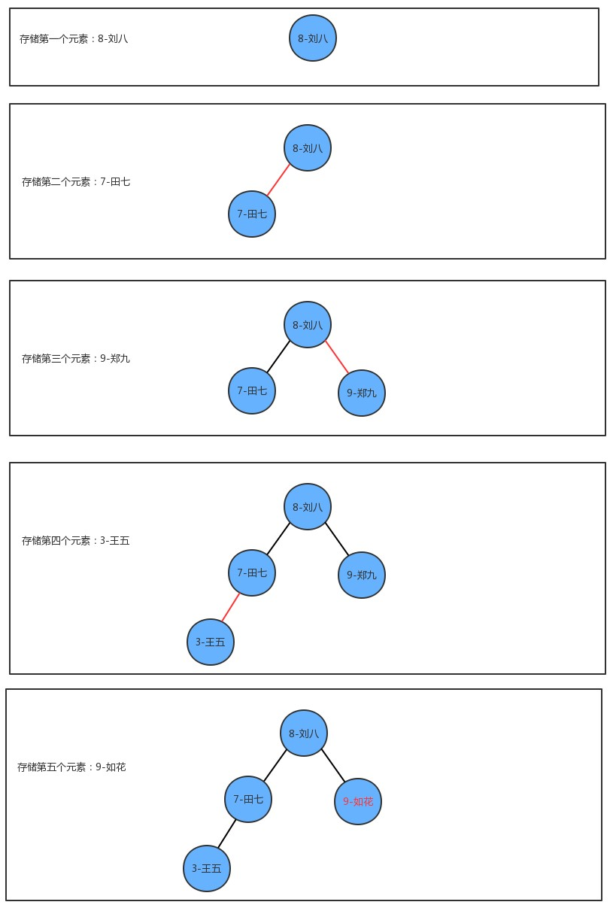

**查询方法 get 实现思想**：

从根节点开始：

1. 如果要查询的 key 小于当前结点的 key，则继续找当前结点的左子结点
2. 如果要查询的 key 大于当前结点的 key，则继续找当前结点的右子结点
3. 如果要查询的 key 等于当前结点的 key，则树中返回当前结点的 value

**删除方法 delete 实现思想**：

1. 找到被删除结点
2. 找到被删除结点右子树中的最小结点 minNode
3. 删除右子树中的最小结点
4. 让被删除结点的左子树成为最小结点 minNode 的左子树，让被删除结点的右子树成为最小结点 minNode 的右子树
5. 让被删除结点的父节点指向最小结点 minNode

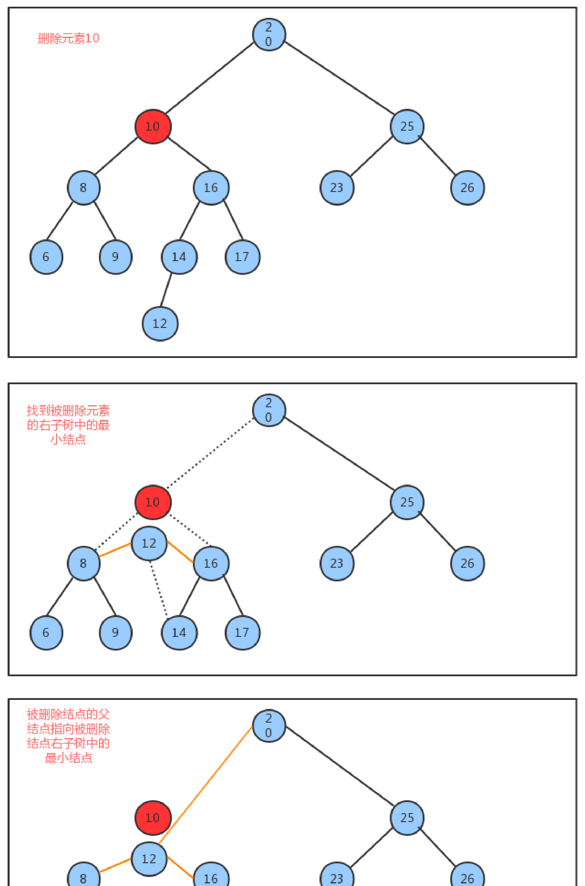

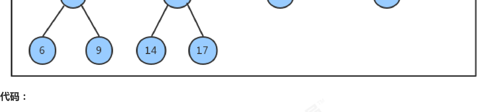

```java
public class BinaryTree<Key extends Comparable<Key>,Value> {
    //记录根节点
    private Node root;
    //记录树中元素的个数
    private int N;

    private class Node{
        //存储键
        public Key key;
        //存储值
        private Value value;
        //记录左子结点
        public Node left;
        //记录右子结点
        public Node right;

        public Node(Key key, Value value, Node left, Node right) {
            this.key = key;
            this.value = value;
            this.left = left;
            this.right = right;
        }
    }

    //获取树中元素的个数
    public int size() {
        return N;
    }

    //向树中添加元素key-value
    public void put(Key key, Value value) {
        root = put(root, key, value);
    }

    //向指定的树x中添加key-value，并返回添元素后的新树
    private Node put(Node x, Key key, Value value) {
        //如果x子树为空
        if (x == null) {
            N++;
            return new Node(key, value, null, null);
        }

        //如果x子树不为空，则比较x结点的键和key的大小
        int cmp = key.compareTo(x.key);
        if (cmp > 0) {
            //如果key大于x结点的键，则继续找x结点的右子树
            x.right = put(x.right, key, value);
        }else if (cmp < 0) {
            //如果key小于x结点的键，则继续找x结点的左子树
            x.left = put(x.left, key, value);
        }else {
            //如果key等于x结点的键，则替换x结点的值为value即可
            x.value = value;
        }

        return x;
    }

    //查询树中指定key对应的value
    public Value get(Key key) {
        return get(root, key);
    }

    //从指定的树x中，查找key对应的值
    public Value get(Node x, Key key) {
        //如果x树为空
        if (x == null) {
            return null;
        }

        //如果x树不为空，则毕节key和x结点的键的大小
        int cmp = key.compareTo(x.key);
        if (cmp > 0) {
            //如果key大于x结点的键，则继续找x结点的右子树
            return get(x.right, key);
        }else if (cmp < 0) {
            //如果key小于x结点的键，则继续找x结点的左子树
            return get(x.left, key);
        }else {
            //如果key等于x结点的键，则返回x结点的值即可
            return x.value;
        }
    }

    //删除树中key对应的value
    public void delete(Key key) {
        delete(root, key);
    }

    //删除指定树x中的key对应的value，并返回删除后的新树
    public Node delete(Node x, Key key) {
        //如果x树为null
        if (x == null) {
            return null;
        }

        //如果x树不为null
        int cmp = key.compareTo(x.key);
        if (cmp > 0) {
            //如果key大于x结点的键，则继续找x结点的右子树
            x.right = delete(x.right, key);
        }else if (cmp < 0) {
            //如果key小于x结点的键，则继续找x结点的左子树
            x.left = delete(x.left, key);
        }else {
            //如果key等于x结点的键，则要删除的结点就是x，完成真正的删除结点动作
            N--;

            //如果x右子树为null
            if (x.right == null) {
                return x.left;
            }
            //如果x左子树为null
            if (x.left == null) {
                return x.right;
            }

            //如果左右子树都不为空，先找到右子树中最小的结点
            Node minNode = x.right;
            while (minNode.left != null) {
                minNode = minNode.left;
            }

            //删除右子树中最小的结点
            Node n = x.right;
            while (n.left != null) {
                if (n.left.left == null) {
                    n.left = null;
                }else {
                    n = n.left;
                }
            }

            //让x结点的左右子树分别成为minNode的左右子树
            minNode.left = x.left;
            minNode.right = x.right;
            //让x结点的父结点指向minNode
            x = minNode;
        }

        return x;
    }
}
```

测试代码：

```java
public class BinaryTreeTest {
    public static void main(String[] args) {
        BinaryTree<Integer, String> tree = new BinaryTree<>();

        //测试插入
        tree.put(1, "张三");
        tree.put(2, "李四");
        tree.put(3, "王五");
        System.out.println("插入完毕后元素的个数：" + tree.size());

        //测试获取
        System.out.println("键2对应的元素是：" + tree.get(2));

        //测试删除
        tree.delete(3);
        System.out.println("删除后的元素个数：" + tree.size());
        System.out.println("删除后键3对应的元素是：" + tree.get(3));
    }
}
```

## 4、二叉查找树其他便捷方法

### 4.1、查找二叉树中最小的键

在某些情况下，我们需要查找出树中存储所有元素的键的最小值，比如我们的树中存储的是学生的排名和姓名数据，那么需要查找出排名最低是多少名？这里我们设计如下两个方法来完成：

* `public Key min()`：找出树中最小的键
* `private Node min(Node x)`：找出指定树 x 中，最小键所在的结点

```java
//查找整个树中最小的键
public Key min() {
    return min(root).key;
}

//在指定树x中找出最小键所在的结点
public Node min(Node x) {
    //如果x还有左子结点，则继续找
    if (x.left != null){
        return min(x.left);
    }else { //若没有，则x就是最小键所在的结点
        return x;
    }
}
```

### 4.2、查找二叉树中最大的键

在某些情况下，我们需要查找出树中存储所有元素的键的最大值，比如比如我们的树中存储的是学生的成绩和学生的姓名，那么需要查找出最高的分数是多少？这里我们同样设计两个方法来完成：

* `public Key max()`：找出树中最大的键
* `public Node max(Node x)`：找出指定树 x 中，最大键所在的结点

```java
//查找整个树中最大的键
public Key max() {
    return max(root).key;
}

//在指定树x中找出最大键所在的结点
public Node max(Node x) {
    //如果x还有右子结点，则继续找
    if (x.left != null) {
        return max(x.left);
    }else { //若没有，则x就是最大键所在的结点
        return x;
    }
}
```

# 五、二叉树的基础遍历

## 1、概述

很多情况下，我们可能需要像遍历数组数组一样，遍历树，从而拿出树中存储的每一个元素，由于树状结构和线性结构不一样，它没有办法从头开始依次向后遍历，所以存在如何遍历，也就是按照什么样的**搜索路径**进行遍历的问题。

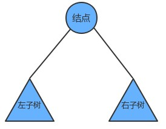

我们把树简单的画作上图中的样子，由一个根节点、一个左子树、一个右子树组成，那么按照根节点什么时候被访问，我们可以把二叉树的遍历分为以下三种方式：

1. 前序遍历：先访问根结点，然后再访问左子树，最后访问右子树

2. 中序遍历：先访问左子树，中间访问根节点，最后访问右子树

3. 后序遍历：先访问左子树，再访问右子树，最后访问根节点

如果我们对下面的树使用三种遍历方式进行遍历，得到的结果如下：

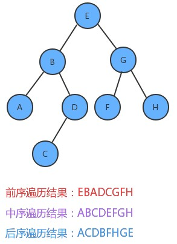

## 2、前序遍历

我们在之前创建的二叉查找树中，添加前序遍历的 API：

* `public Queue preErgodic()`：使用前序遍历，获取整个树中的所有键
* `private void preErgodic(Node x,Queue keys)`：使用前序遍历，把指定树 x 中的所有键放入到 keys 队列中

实现过程中，我们通过前序遍历，把每个结点的键取出，放入到队列中返回即可

**实现步骤**：

1. 把当前结点的 key 放入到队列中
2. 找到当前结点的左子树，如果不为空，递归遍历左子树
3. 找到当前结点的右子树，如果不为空，递归遍历右子树

代码实现：

```java
//使用前序遍历获取整个树中所有的键
public Queue<Key> preErgodic() {
    Queue<Key> keys = new ArrayDeque<>();
    preErgodic(root, keys);
    return keys;
}

//使用前序遍历，获取指定树x的所有键，并放到keys队列中
public void preErgodic(Node x, Queue<Key> keys) {
    if (x == null) {
        return;
    }

    //把x结点的key放入到keys中
    keys.add(x.key);

    //递归遍历x结点的左子树
    if (x.left != null) {
        preErgodic(x.left, keys);
    }

    //递归遍历x结点的右子树
    if (x.right != null) {
        preErgodic(x.right, keys);
    }
}
```

测试代码：

```java
import tree.BinaryTree;

import java.util.Queue;

public class BinaryTreeErgodicTest {
    public static void main(String[] args) {
        //创建树对象
        BinaryTree<String, String> tree = new BinaryTree<>();

        //往树中添加数据
        tree.put("E", "5");
        tree.put("B", "2");
        tree.put("G", "7");
        tree.put("A", "1");
        tree.put("D", "4");
        tree.put("F", "6");
        tree.put("H", "8");
        tree.put("C", "3");
        
        //前序遍历
        Queue<String> keys = tree.preErgodic();
        for (String key : keys) {
            String value = tree.get(key);
            System.out.println(key + "-----" + value);
        }
    }
}
```

## 3、中序遍历

我们在之前创建的二叉树中，添加中序遍历的 API：

* `public Queue<Key> midErgodic()`：使用中序遍历，获取整个树中的所有键

* `private void midErgodic(Node x, Queue<Key> keys)`：使用中序遍历，把指定树 x 中的所有键放入到 keys 队列中

**实现步骤**：

1. 找到当前结点的左子树，如果不为空，递归遍历左子树
2. 把当前结点的 key 放入到队列中
3. 找到当前结点的右子树，如果不为空，递归遍历右子树

代码：

```java
//使用中序遍历获取树中所有的键
public Queue<Key> midErgodic() {
    Queue<Key> keys = new ArrayDeque<>();
    midErgodic(root, keys);
    return keys;
}

//使用中序遍历，获取指定树x中所有的键，并存放到keys队列中
private void midErgodic(Node x, Queue<Key> keys) {
    if (x == null) {
        return;
    }

    //先递归把左子树中的键方道keys中
    if (x.left != null) {
        midErgodic(x.left, keys);
    }

    //把当前结点x的键方道keys中
    keys.add(x.key);

    //再递归把右子树中的键方道keys中
    if (x.right != null) {
        midErgodic(x.right, keys);
    }
}
```

测试代码：

```java
import tree.BinaryTree;

import java.util.Queue;

public class BinaryTreeErgodicTest {
    public static void main(String[] args) {
        //创建树对象
        BinaryTree<String, String> tree = new BinaryTree<>();

        //往树中添加数据
        tree.put("E", "5");
        tree.put("B", "2");
        tree.put("G", "7");
        tree.put("A", "1");
        tree.put("D", "4");
        tree.put("F", "6");
        tree.put("H", "8");
        tree.put("C", "3");

        //中序遍历
        Queue<String> keys = tree.midErgodic();
        for (String key : keys) {
            String value = tree.get(key);
            System.out.println(key + "-----" + value);
        }
    }
}
```

## 4、后序遍历

我们在上述步骤中创建的树上，添加后序遍历的 API：

* `public Queue<Key> afterErgodic()`：使用后序遍历，获取整个树中的所有键

* `private void afterErgodic(Node x, Queue<Key> keys)`：使用后序遍历，把指定树 x 中的所有键放入到 keys 队列中

**实现步骤**：

1. 找到当前结点的左子树，如果不为空，递归遍历左子树
2. 找到当前结点的右子树，如果不为空，递归遍历右子树
3. 把当前结点的 key 放入到队列中

代码：

```java
// 使用后序遍历获取树中所有的键
public Queue<Key> afterErgodic() {
    Queue<Key> keys = new ArrayDeque<>();
    afterErgodic(root, keys);
    return keys;
}

// 使用后序遍历，把指定树x中所有的键放入到keys队列中
private void afterErgodic(Node x, Queue<Key> keys) {
    if (x == null) {
        return;
    }

    // 通过递归把左子树中所有的键放入到keys中
    if (x.left != null) {
        afterErgodic(x.left, keys);
    }
    // 通过递归把右子树中所有的键放入到keys中
    if (x.right != null) {
        afterErgodic(x.right, keys);
    }
    // 把x结点的键放入到keys中
    keys.add(x.key);
}
```

测试代码：

```java
public class BinaryTreeErgodicTest {
    public static void main(String[] args) {
        //创建树对象
        BinaryTree<String, String> tree = new BinaryTree<>();

        //往树中添加数据
        tree.put("E", "5");
        tree.put("B", "2");
        tree.put("G", "7");
        tree.put("A", "1");
        tree.put("D", "4");
        tree.put("F", "6");
        tree.put("H", "8");
        tree.put("C", "3");

        // 测试后序遍历
        Queue<String> keys_after = tree.afterErgodic();
        System.out.println("后序遍历的结果：");
        for (String key : keys_after) {
            String value = tree.get(key);
            System.out.println(key + "-----" + value);
        }
    }
}
```

# 六、二叉树的层序遍历

所谓的层序遍历，就是从根节点（第一层）开始，依次向下，获取每一层所有结点的值。

比如有如下图的一棵二叉树：

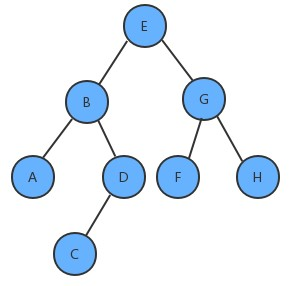

那么其层序遍历的结果是：EBGADFHC

我们在之前创建的二叉树中，添加层序遍历的 API：

`public Queue<Key> layerErgodic()`：使用层序遍历，获取整个树中的所有键

**实现步骤**：

1. 创建队列，存储每一层的结点
2. 使用循环从队列中弹出一个结点：
   * 获取当前结点的 key
   * 如果当前结点的左子结点不为空，则把左子结点放入到队列中
   * 如果当前结点的右子结点不为空，则把右子结点放入到队列中

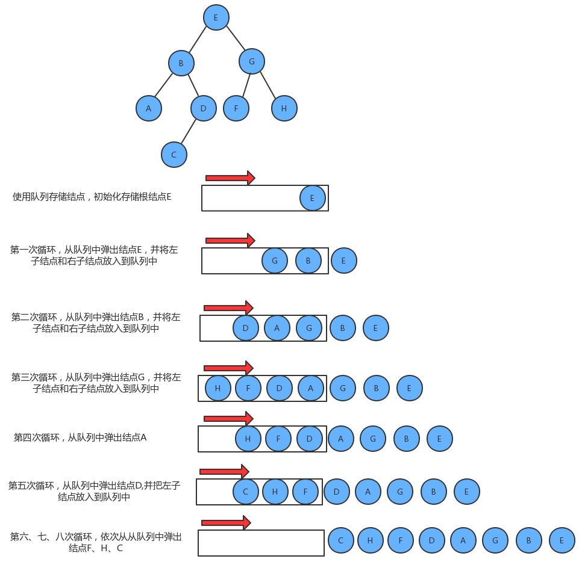

**代码实现**：

```java
// 使用层序遍历获取整个树中所有的键
public Queue<Key> layerErgodic() {
    // 定义两个队列，分别存储树中的键和树中的结点
    Queue<Key> keys = new ArrayDeque<>();
    Queue<Node> nodes = new ArrayDeque<>();

    // 默认往队列中放入根节点
    nodes.add(root);
    
    while (!nodes.isEmpty()) {
        //从队列中弹出一个节点，把它的key放入到keys队列中
        Node node = nodes.poll();
        keys.add(node.key);

        // 判断当前结点有没有左子结点，有则放入到nodes队列中
        if (node.left != null) {
            nodes.add(node.left);
        }

        // 判断当前结点有没有右子结点，有则放入到nodes队列中
        if (node.right != null) {
            nodes.add(node.right);
        }
    }
    return keys;
}
```

测试代码：

```java
public class BinaryTreeErgodicTest {
    public static void main(String[] args) {
        //创建树对象
        BinaryTree<String, String> tree = new BinaryTree<>();

        //往树中添加数据
        tree.put("E", "5");
        tree.put("B", "2");
        tree.put("G", "7");
        tree.put("A", "1");
        tree.put("D", "4");
        tree.put("F", "6");
        tree.put("H", "8");
        tree.put("C", "3");

        // 测试层序遍历
        Queue<String> keys_layer = tree.layerErgodic();
        System.out.println("层序遍历的结果：");
        for (String key : keys_layer) {
            String value = tree.get(key);
            System.out.println(key + "-----" + value);
        }
    }
}
```

# 七、二叉树的最大深度问题

**需求**：

给定一棵树，请计算树的最大深度（树的根节点到最远叶子结点的最长路径上的结点数）


上面这棵树的最大深度为 4。

我们在之前创建的二叉树中，添加如下的 API 求最大深度：

* `public int maxDepth()`：计算整个树的最大深度
* `private int maxDepth(Node x)`：计算指定树 x 的最大深度

**实现步骤**：

1. 如果根结点为空，则最大深度为 0
2. 计算左子树的最大深度
3. 计算右子树的最大深度
4. 当前树的最大深度 = 左子树的最大深度和右子树的最大深度中的较大者 + 1

**代码**：

```java
// 获取整个树的最大深度
public int maxDepth() {
    return maxDepth(root);
}

// 获取指定树x的最大深度
private int maxDepth(Node x) {
    if (x == null) {
        return 0;
    }

    // 树x的最大深度
    int max = 0;
    // 左子树的最大深度
    int maxLeft = 0;
    // 右子树的最大深度
    int maxRight = 0;

    // 计算x结点左子树的最大深度
    if (x.left != null) {
        maxLeft = maxDepth(x.left);
    }
    // 计算x结点右子树的最大深度
    if (x.right != null) {
        maxRight = maxDepth(x.right);
    }

    // 比较左子树和右子树的最大深度，取最大值 +1 即可
    max = maxLeft > maxRight ? maxLeft + 1 : maxRight + 1;
    return max;
}
```

测试代码：

```java
public class BinaryTreeMaxDepthTest {
    public static void main(String[] args) {
        //创建树对象
        BinaryTree<String, String> tree = new BinaryTree<>();

        //往树中添加数据
        tree.put("E", "5");
        tree.put("B", "2");
        tree.put("G", "7");
        tree.put("A", "1");
        tree.put("D", "4");
        tree.put("F", "6");
        tree.put("H", "8");
        tree.put("C", "3");

        int maxDepth = tree.maxDepth();
        System.out.println(maxDepth);
    }
}
```

# 八、折纸问题

**需求**：

把一段纸条竖着放在桌子上，然后从纸条的下边向上方对折 1 次，压出折痕后展开。此时折痕是凹下去的，即折痕突起的方向指向纸条的背面。如果从纸条的下边向上方连续对折 2 次，压出折痕后展开，此时有三条折痕，从上到下依次是下折痕、下折痕和上折痕。

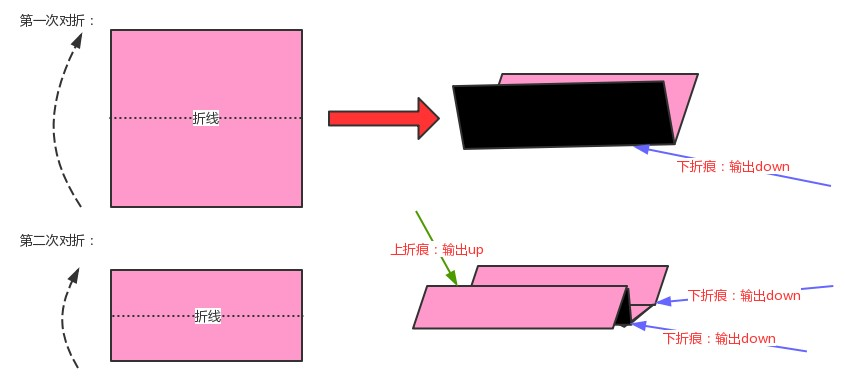

给定一个输入参数 N，代表纸条都从下边向上方连续对折 N 次，请从上到下打印所有折痕的方向。例如：N = 1 时，打印：down；N = 2 时，打印：down down up

**分析**：

我们把对折后的纸张翻过来，让粉色朝下，这时把第一次对折产生的折痕看做是根结点，那第二次对折产生的下折痕就是该结点的左子结点，而第二次对折产生的上折痕就是该结点的右子结点，这样我们就可以使用树形数据结构来描述对折后产生的折痕。

这棵树有这样的特点：

* 根结点为下折痕
* 每一个结点的左子结点为下折痕
* 每一个结点的右子结点为上折痕

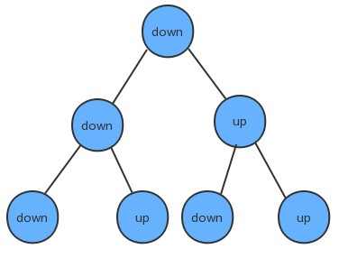

**实现步骤**：

1. 定义结点类
2. 构建深度为 N 的折痕树
3. 使用中序遍历，打印出树中所有结点的内容

构建深度为 N 的折痕树：

1. 第一次对折，只有一条折痕，创建根结点
2. 如果不是第一次对折，则使用队列保存根结点
3. 循环遍历队列：
   * 从队列中拿出一个结点
   * 如果这个结点的左子结点不为空，则把这个左子结点添加到队列中
   * 如果这个结点的右子结点不为空，则把这个右子结点添加到队列中
   * 判断当前结点的左子结点和右子结点是否都为空，如果是，则需要为当前结点创建一个值为 down 的左子结点和一个值为 up 的右子结点

**代码**：

```java
public class PaperFoldingTest {
    public static void main(String[] args) {
        // 模拟折纸过程，产生树
        Node<String> tree = createTree(3);
        // 遍历树，打印每个结点
        printTree(tree);
    }

    // 模拟对折N次纸产生树
    private static Node<String> createTree(int N) {
        // 定义根节点
        Node<String> root = null;
        for (int i = 0; i < N; i++) {
            // 1.当前是第一次对折
            if (i == 0) {
                root = new Node<>("down", null, null);
                continue;
            }
            // 2.当前不是第一次对折
            // 定义一个辅助队列，通过层序遍历找到叶子结点，给叶子结点添加子结点
            Queue<Node<String>> queue = new ArrayDeque<>();
            queue.add(root);

            // 循环遍历队列
            while (!queue.isEmpty()) {
                // 从队列中弹出一个结点
                Node<String> node = queue.poll();
                // 如果有左子结点，则把左子结点添加到队列中
                if (node.left != null) {
                    queue.add(node.left);
                }
                // 如果有右子结点，则把右子结点添加到队列中
                if (node.right != null) {
                    queue.add(node.right);
                }
                // 如果既没有左子结点也没有右子结点，证明是叶子结点，给它添加左子结点和右子结点即可
                if (node.left == null && node.right == null ) {
                    node.left = new Node<>("down", null, null);
                    node.right = new Node<>("up", null, null);
                }
            }
        }
        return root;
    }

    // 打印树中每个结点
    public static void printTree(Node<String> root) {
        // 需要使用中序遍历完成
        if (root == null) {
            return;
        }
        // 打印左子树的每个结点
        if (root.left != null) {
            printTree(root.left);
        }
        // 打印当前结点
        System.out.println(root.item);
        // 打印右子树的最小结点
        if (root.right != null) {
            printTree(root.right);
        }
    }

    // 结点类
    private static class Node<T> {
        public T item; //存储元素
        public Node<T> left;
        public Node<T> right;

        public Node(T item, Node<T> left, Node<T> right) {
            this.item = item;
            this.left = left;
            this.right = right;
        }
    }
}
```
